# DB 設計書

> ORM: Prisma | DB: PostgreSQL 16 | 全エンティティ: 16 | 中間テーブル: 6 | 総テーブル数: 22

---

## 1. エンティティ一覧

| テーブル名 | 種別 | 説明 |
|---|---|---|
| `User` | エンティティ | 全機能の中心。42 API OAuth、2FA 設定を含む |
| `UserStats` | エンティティ (1:1) | APM/PPS/勝率などのゲーム統計 |
| `UserGameSettings` | エンティティ (1:1) | スキン・ゴースト・キーバインド等のゲーム設定 |
| `GameResult` | エンティティ | 全対戦の結果・詳細データ |
| `GameAnalytic` | エンティティ | 日次集計データ（ダッシュボード高速化） |
| `SprintRecord` | エンティティ | 40 Lines 等のソロプレイのクリアタイム記録 |
| **`Friendship`** | **中間テーブル** | User ↔ User（PENDING/ACCEPTED/REJECTED） |
| **`Block`** | **中間テーブル** | User ↔ User（ブロック関係） |
| `ChatRoom` | エンティティ | GLOBAL/DIRECT/GAME/TOURNAMENT のチャット部屋 |
| **`ChatRoomMembership`** | **中間テーブル** | User ↔ ChatRoom（既読管理付き） |
| `ChatMessage` | エンティティ | チャット履歴（ソフトデリート対応） |
| `Notification` | エンティティ | 全通知（種別・既読管理） |
| `Tournament` | エンティティ | トーナメント管理（状態機械） |
| **`TournamentEntry`** | **中間テーブル** | User ↔ Tournament（シード・順位付き） |
| `TournamentMatch` | エンティティ | トーナメントの各試合（ブラケット） |
| `Organization` | エンティティ | クラン/ギルド |
| **`OrgMembership`** | **中間テーブル** | User ↔ Organization（役割付き） |
| `Achievement` | エンティティ | 実績定義（マスターデータ） |
| **`UserAchievement`** | **中間テーブル** | User ↔ Achievement（取得日付き） |
| `ApiKey` | エンティティ | 公開 API キー（ハッシュ保存） |
| `FileUpload` | エンティティ | アバター・チャット添付ファイル |
| `DataExportRequest` | エンティティ | GDPR データ開示・削除リクエスト |

---

## 2. ER 図

```mermaid
erDiagram
    User {
        uuid id PK
        string email UK
        string username UK
        string displayName
        string passwordHash "nullable if OAuth only"
        string avatarUrl
        text bio
        string role "ADMIN MODERATOR USER GUEST"
        bool isOnline
        datetime lastSeenAt
        datetime bannedUntil "nullable"
        string banReason "nullable"
        string oauthProvider "nullable"
        string oauthId "nullable"
        bool twoFactorEnabled
        datetime deletedAt "nullable soft delete"
        datetime createdAt
        datetime updatedAt
    }

    UserStats {
        uuid id PK
        uuid userId FK "UNIQUE 1to1"
        int wins
        int losses
        int totalGames
        decimal winRate
        decimal bestApm
        decimal avgApm
        decimal bestPps
        decimal avgPps
        int totalLinesCleared
        int totalTSpins
        int totalTetrises
        int currentWinStreak
        int bestWinStreak
        int xp
        int level
        string rank "BRONZE SILVER GOLD PLATINUM DIAMOND MASTER"
        int rankPoints
    }

    UserGameSettings {
        uuid id PK
        uuid userId FK "UNIQUE 1to1"
        string minoSkin "NEON RETRO MINIMAL"
        bool showGhost
        int arr
        int das
        int dcd
        int sdf
        json keyBindings
        int volume
        bool sfxEnabled
        bool musicEnabled
    }

    GameResult {
        uuid id PK
        string roomId "ephemeral room UUID"
        uuid player1Id FK
        uuid player2Id FK "nullable vs AI"
        uuid winnerId FK "nullable if abandoned"
        bool isAiGame
        string aiDifficulty "EASY MEDIUM HARD nullable"
        decimal player1Apm
        decimal player2Apm "nullable"
        decimal player1Pps
        decimal player2Pps "nullable"
        int player1LinesCleared
        int player2LinesCleared "nullable"
        int player1TSpins
        int player2TSpins
        int player1Tetrises
        int player2Tetrises
        int garbageSent1to2
        int garbageSent2to1
        int durationSeconds
        string gameMode "VERSUS AI TOURNAMENT"
        uuid tournamentMatchId FK "nullable"
        datetime createdAt
    }

    SprintRecord {
        uuid id PK
        uuid userId FK
        int timeMs
        int lines
        int pieces "nullable"
        datetime createdAt
    }

    GameAnalytic {
        uuid id PK
        uuid userId FK
        date date
        int gamesPlayed
        int wins
        int losses
        decimal avgApm
        decimal avgPps
        int totalLinesCleared
        int totalPlaytimeSeconds
    }

    Friendship {
        uuid id PK
        uuid requesterId FK
        uuid addresseeId FK
        string status "PENDING ACCEPTED REJECTED"
        datetime createdAt
        datetime updatedAt
    }

    Block {
        uuid id PK
        uuid blockerId FK
        uuid blockedId FK
        datetime createdAt
    }

    ChatRoom {
        uuid id PK
        string type "GLOBAL DIRECT GAME TOURNAMENT"
        string name "nullable"
        uuid relatedId "nullable"
        datetime createdAt
    }

    ChatRoomMembership {
        uuid id PK
        uuid roomId FK
        uuid userId FK
        datetime lastReadAt "nullable for read receipts"
        datetime joinedAt
    }

    ChatMessage {
        uuid id PK
        uuid roomId FK
        uuid senderId FK "nullable if user deleted"
        text content
        bool isDeleted
        datetime deletedAt "nullable"
        datetime editedAt "nullable"
        datetime createdAt
    }

    Notification {
        uuid id PK
        uuid userId FK
        string type "FRIEND_REQUEST GAME_INVITE etc"
        string title
        text content
        uuid relatedId "nullable polymorphic"
        string relatedType "nullable"
        bool isRead
        datetime readAt "nullable"
        datetime createdAt
    }

    Tournament {
        uuid id PK
        string name
        text description
        uuid creatorId FK
        string status "REGISTRATION SEEDING IN_PROGRESS COMPLETED CANCELLED"
        int maxPlayers "4 8 or 16"
        int minPlayers
        datetime registrationDeadline "nullable"
        datetime startedAt "nullable"
        datetime endedAt "nullable"
        uuid winnerId FK "nullable"
        datetime createdAt
    }

    TournamentEntry {
        uuid id PK
        uuid tournamentId FK
        uuid userId FK
        int seed "nullable until seeding"
        int finalRank "nullable until completion"
        datetime registeredAt
    }

    TournamentMatch {
        uuid id PK
        uuid tournamentId FK
        int round
        int matchNumber
        uuid player1Id FK "nullable until set"
        uuid player2Id FK "nullable until set"
        uuid winnerId FK "nullable until completed"
        uuid gameResultId FK "nullable until played"
        string status "PENDING READY IN_PROGRESS COMPLETED BYE"
        datetime scheduledAt "nullable"
        datetime completedAt "nullable"
    }

    Organization {
        uuid id PK
        string name UK
        string slug UK
        text description
        string avatarUrl
        int maxMembers
        bool isPublic
        uuid creatorId FK
        datetime createdAt
        datetime updatedAt
    }

    OrgMembership {
        uuid id PK
        uuid orgId FK
        uuid userId FK
        string role "OWNER ADMIN MEMBER"
        uuid invitedBy FK "nullable"
        datetime joinedAt
    }

    Achievement {
        uuid id PK
        string key UK
        string name
        text description
        string iconUrl
        int xpReward
        string category "GAME SOCIAL TOURNAMENT SPECIAL"
        bool isSecret
        datetime createdAt
    }

    UserAchievement {
        uuid id PK
        uuid userId FK
        uuid achievementId FK
        datetime earnedAt
    }

    ApiKey {
        uuid id PK
        uuid userId FK
        string label
        string keyPrefix
        string keyHash UK
        int rateLimit
        bool isActive
        datetime lastUsedAt "nullable"
        datetime expiresAt "nullable"
        datetime createdAt
    }

    FileUpload {
        uuid id PK
        uuid uploaderId FK
        string filename
        string originalName
        string mimeType
        bigint sizeBytes
        string storageUrl
        string purpose "AVATAR CHAT_ATTACHMENT EXPORT"
        bool isPublic
        datetime createdAt
    }

    DataExportRequest {
        uuid id PK
        uuid userId FK
        string status "PENDING PROCESSING READY DOWNLOADED EXPIRED"
        datetime requestedAt
        datetime processedAt "nullable"
        string fileUrl "nullable"
        datetime expiresAt "nullable"
    }

    %% ─── リレーション定義 ───
    User ||--|| UserStats : "1:1"
    User ||--|| UserGameSettings : "1:1"
    User ||--o{ GameResult : "player1"
    User ||--o{ GameResult : "player2"
    User ||--o{ GameAnalytic : "daily stats"
    User ||--o{ Friendship : "requester"
    User ||--o{ Friendship : "addressee"
    User ||--o{ Block : "blocker"
    User ||--o{ Block : "blocked"
    User ||--o{ ChatRoomMembership : "member"
    User ||--o{ ChatMessage : "sender"
    User ||--o{ Notification : "receives"
    User ||--o{ TournamentEntry : "participates"
    User ||--o{ OrgMembership : "belongs_to"
    User ||--o{ UserAchievement : "earns"
    User ||--o{ ApiKey : "owns"
    User ||--o{ FileUpload : "uploads"
    User ||--o{ DataExportRequest : "requests"
    User ||--o{ SprintRecord : "records"
    Tournament ||--o{ TournamentEntry : "has entries"
    Tournament ||--o{ TournamentMatch : "has matches"
    TournamentMatch ||--o| GameResult : "result"
    ChatRoom ||--o{ ChatRoomMembership : "members"
    ChatRoom ||--o{ ChatMessage : "messages"
    Organization ||--o{ OrgMembership : "members"
    Achievement ||--o{ UserAchievement : "earned by"
```



---

## 3. 中間テーブル詳細

### 3-1. `Friendship`（フレンド申請・承認）

**目的:** ユーザー間の友達関係を管理。方向性あり（申請者 → 受信者）

```
Friendship
├── id: UUID PK
├── requesterId: UUID FK → User.id ON DELETE CASCADE
├── addresseeId: UUID FK → User.id ON DELETE CASCADE
├── status: ENUM(PENDING, ACCEPTED, REJECTED)
├── createdAt: TIMESTAMP DEFAULT NOW()
└── updatedAt: TIMESTAMP

制約:
  UNIQUE(requesterId, addresseeId)        -- 重複申請防止
  CHECK(requesterId != addresseeId)       -- 自分自身へのフレンド防止

インデックス:
  INDEX(addresseeId, status)              -- 受信した申請一覧
  INDEX(requesterId, status)              -- 送信した申請一覧
  INDEX(status, createdAt DESC)           -- 未処理申請の古い順
```

**状態機械:**
```
PENDING → ACCEPTED  (受信者が承認)
PENDING → REJECTED  (受信者が拒否、再申請を防ぐためレコードは残す)
ACCEPTED → (レコード削除でフレンド解除)
```

---

### 3-2. `Block`（ブロック）

**目的:** ユーザー間のブロック関係。チャット/通知の非表示に使用。Friendship とは独立。

```
Block
├── id: UUID PK
├── blockerId: UUID FK → User.id ON DELETE CASCADE
├── blockedId: UUID FK → User.id ON DELETE CASCADE
└── createdAt: TIMESTAMP DEFAULT NOW()

制約:
  UNIQUE(blockerId, blockedId)            -- 重複ブロック防止
  CHECK(blockerId != blockedId)           -- 自分自身をブロック防止

インデックス:
  INDEX(blockerId)                        -- ブロック一覧取得
  INDEX(blockedId)                        -- 「自分がブロックされているか」確認
```

---

### 3-3. `ChatRoomMembership`（チャット部屋参加）

**目的:** ユーザーとチャットルームの N:M 関係。既読管理を兼ねる。

```
ChatRoomMembership
├── id: UUID PK
├── roomId: UUID FK → ChatRoom.id ON DELETE CASCADE
├── userId: UUID FK → User.id ON DELETE CASCADE
├── lastReadAt: TIMESTAMP NULL     -- 最後に既読にした時刻（未読バッジ計算用）
└── joinedAt: TIMESTAMP DEFAULT NOW()

制約:
  UNIQUE(roomId, userId)            -- 同じ部屋に同じユーザーが2回参加防止

インデックス:
  INDEX(userId, roomId)             -- ユーザーの参加ルーム一覧
  INDEX(roomId)                     -- ルームの参加者一覧
```

---

### 3-4. `TournamentEntry`（トーナメント参加）

**目的:** ユーザーとトーナメントの N:M 関係。シード値・最終順位を管理。

```
TournamentEntry
├── id: UUID PK
├── tournamentId: UUID FK → Tournament.id ON DELETE CASCADE
├── userId: UUID FK → User.id ON DELETE CASCADE
├── seed: INT NULL                  -- NULL = 未シード (REGISTRATION フェーズ)
├── finalRank: INT NULL             -- NULL = 進行中
└── registeredAt: TIMESTAMP DEFAULT NOW()

制約:
  UNIQUE(tournamentId, userId)      -- 同一トーナメントへの二重参加防止
  UNIQUE(tournamentId, seed)        -- 同一シードに2人割当防止（NULLは除外）

インデックス:
  INDEX(tournamentId, seed)         -- シード順でのブラケット生成
  INDEX(userId, registeredAt DESC)  -- ユーザーの参加トーナメント履歴
```

---

### 3-5. `OrgMembership`（クラン参加）

**目的:** ユーザーと組織の N:M 関係。役割（OWNER/ADMIN/MEMBER）付き。

```
OrgMembership
├── id: UUID PK
├── orgId: UUID FK → Organization.id ON DELETE CASCADE
├── userId: UUID FK → User.id ON DELETE CASCADE
├── role: ENUM(OWNER, ADMIN, MEMBER)
├── invitedBy: UUID FK NULL → User.id ON DELETE SET NULL
└── joinedAt: TIMESTAMP DEFAULT NOW()

制約:
  UNIQUE(orgId, userId)             -- 同一クランへの二重参加防止

インデックス:
  INDEX(orgId, role)                -- 役割別メンバー一覧
  INDEX(userId)                     -- ユーザーの参加クラン一覧
```

---

### 3-6. `UserAchievement`（実績取得）

**目的:** ユーザーと実績の N:M 関係。取得日時を記録。

```
UserAchievement
├── id: UUID PK
├── userId: UUID FK → User.id ON DELETE CASCADE
├── achievementId: UUID FK → Achievement.id ON DELETE CASCADE
└── earnedAt: TIMESTAMP DEFAULT NOW()

制約:
  UNIQUE(userId, achievementId)     -- 同じ実績の二重取得防止

インデックス:
  INDEX(userId, earnedAt DESC)      -- プロフィール表示用（最新順）
  INDEX(achievementId)              -- 実績取得者一覧
```

---


## 4. 各テーブルの定義

各テーブルの物理的な構造（カラム、型、制約）です。

### 4-1. User
```sql
User (
    id UUID PRIMARY KEY DEFAULT uuid_generate_v4(),            -- ユニークなユーザーID、デフォルトはuuid_generate_v4()で自動生成
    email VARCHAR(255) NOT NULL UNIQUE,                        -- メールアドレス、ログイン用途および一意性を保証
    username VARCHAR(100) NOT NULL UNIQUE,                     -- アプリ内で表示・検索される一意のユーザー名
    displayName VARCHAR(255) NOT NULL,                         -- 画面表示用の名前（変更可能、一意である必要はない）
    passwordHash VARCHAR(255),                                 -- パスワードのハッシュ値（OAuthのみの場合はNULL）
    avatarUrl VARCHAR(255),                                    -- プロフィール画像のURL
    bio TEXT,                                                  -- ユーザーの自己紹介文
    role VARCHAR(50) NOT NULL DEFAULT 'USER',                  -- 権限ロール（ADMIN, MODERATOR, USER, GUEST）
    isOnline BOOLEAN NOT NULL DEFAULT FALSE,                   -- 現在オンラインかどうかのフラグ
    lastSeenAt TIMESTAMP,                                      -- 最終アクセス日時
    bannedUntil TIMESTAMP,                                     -- BAN（利用停止）の期限（NULLなら有効）
    banReason VARCHAR(255),                                    -- BANされた理由のメモ
    oauthProvider VARCHAR(50),                                 -- OAuthプロバイダー名（例: "42"）
    oauthId VARCHAR(255),                                      -- OAuthプロバイダー側の一意のID
    twoFactorEnabled BOOLEAN NOT NULL DEFAULT FALSE,           -- 2段階認証が有効かどうかのフラグ
    deletedAt TIMESTAMP,                                       -- 論理削除用タイムスタンプ（GDPR対応）
    createdAt TIMESTAMP NOT NULL DEFAULT CURRENT_TIMESTAMP,    -- レコード作成日時
    updatedAt TIMESTAMP NOT NULL DEFAULT CURRENT_TIMESTAMP     -- レコード更新日時
);
```

### 4-2. UserStats
```sql
UserStats (
    id UUID PRIMARY KEY DEFAULT uuid_generate_v4(),                       -- ユニークな統計ID
    userId UUID NOT NULL UNIQUE REFERENCES User(id) ON DELETE CASCADE,    -- Userテーブルへの外部キー（1:1関係、ユーザー削除時に連動削除）
    wins INTEGER NOT NULL DEFAULT 0,                                      -- 勝利数
    losses INTEGER NOT NULL DEFAULT 0,                                    -- 敗北数
    totalGames INTEGER NOT NULL DEFAULT 0,                                -- 総プレイ試合数
    winRate DECIMAL(5,2) NOT NULL DEFAULT 0,                              -- 勝率（計算可能だが高速化のため保存）
    bestApm DECIMAL(8,2) NOT NULL DEFAULT 0,                              -- 自己ベストAPM（Actions Per Minute）
    avgApm DECIMAL(8,2) NOT NULL DEFAULT 0,                               -- 平均APM
    bestPps DECIMAL(6,3) NOT NULL DEFAULT 0,                              -- 自己ベストPPS（Pieces Per Second）
    avgPps DECIMAL(6,3) NOT NULL DEFAULT 0,                               -- 平均PPS
    totalLinesCleared INTEGER NOT NULL DEFAULT 0,                         -- 累計の消去ライン数
    totalTSpins INTEGER NOT NULL DEFAULT 0,                               -- 累計のT-Spin回数
    totalTetrises INTEGER NOT NULL DEFAULT 0,                             -- 累計のTetris（4ライン消し）回数
    currentWinStreak INTEGER NOT NULL DEFAULT 0,                          -- 現在の連勝数
    bestWinStreak INTEGER NOT NULL DEFAULT 0,                             -- 最大連勝数の記録
    xp INTEGER NOT NULL DEFAULT 0,                                        -- 獲得経験値
    level INTEGER NOT NULL DEFAULT 1,                                     -- 現在のレベル
    rank VARCHAR(50) NOT NULL DEFAULT 'BRONZE',                           -- 現在のランク帯（BRONZE, SILVERなど）
    rankPoints INTEGER NOT NULL DEFAULT 0,                                -- ランクのポイント（RP）
    createdAt TIMESTAMP NOT NULL DEFAULT CURRENT_TIMESTAMP,               -- レコード作成日時
    updatedAt TIMESTAMP NOT NULL DEFAULT CURRENT_TIMESTAMP                -- レコード更新日時
);
```

### 4-3. UserGameSettings
```sql
UserGameSettings (
    id UUID PRIMARY KEY DEFAULT uuid_generate_v4(),                       -- ユニークな設定ID
    userId UUID NOT NULL UNIQUE REFERENCES User(id) ON DELETE CASCADE,    -- Userテーブルへの外部キー（1:1関係）
    minoSkin VARCHAR(50) NOT NULL DEFAULT 'NEON',                         -- ミノのデザインスキン
    showGhost BOOLEAN NOT NULL DEFAULT TRUE,                              -- ゴーストブロックの表示設定
    arr INTEGER NOT NULL DEFAULT 33,                                      -- ARR (Auto Repeat Rate: 連続移動速度) ms
    das INTEGER NOT NULL DEFAULT 170,                                     -- DAS (Delayed Auto Shift: 長押し判定までの時間) ms
    dcd INTEGER NOT NULL DEFAULT 0,                                       -- DCD (DAS Cut Delay) ms
    sdf INTEGER NOT NULL DEFAULT 6,                                       -- SDF (Soft Drop Factor: 下移動の倍率)
    keyBindings JSONB,                                                    -- カスタムキーバインド（JSON形式）
    volume INTEGER NOT NULL DEFAULT 100,                                  -- マスター音量（0-100）
    sfxEnabled BOOLEAN NOT NULL DEFAULT TRUE,                             -- SE（効果音）の有効化設定
    musicEnabled BOOLEAN NOT NULL DEFAULT TRUE,                           -- BGMの有効化設定
    createdAt TIMESTAMP NOT NULL DEFAULT CURRENT_TIMESTAMP,               -- レコード作成日時
    updatedAt TIMESTAMP NOT NULL DEFAULT CURRENT_TIMESTAMP                -- レコード更新日時
);
```

### 4-4. GameResult
```sql
GameResult (
    id UUID PRIMARY KEY DEFAULT uuid_generate_v4(),           -- ユニークな試合結果ID
    roomId VARCHAR(255) NOT NULL,                             -- 試合が行われたエフェメラルなルームID
    player1Id UUID REFERENCES User(id) ON DELETE SET NULL,    -- プレイヤー1のID（削除時は履歴を残すためNULL）
    player2Id UUID REFERENCES User(id) ON DELETE SET NULL,    -- プレイヤー2のID（AI対戦時はNULL）
    winnerId UUID REFERENCES User(id) ON DELETE SET NULL,     -- 勝者のID（引き分けや無効試合時はNULL）
    isAiGame BOOLEAN NOT NULL DEFAULT FALSE,                  -- AIとの対戦かどうか
    aiDifficulty VARCHAR(50),                                 -- AIの難易度（EASY, MEDIUM, HARD など）
    player1Apm DECIMAL(8,2) NOT NULL,                         -- プレイヤー1の最終APM
    player2Apm DECIMAL(8,2),                                  -- プレイヤー2の最終APM
    player1Pps DECIMAL(6,3) NOT NULL,                         -- プレイヤー1の最終PPS
    player2Pps DECIMAL(6,3),                                  -- プレイヤー2の最終PPS
    player1LinesCleared INTEGER NOT NULL,                     -- プレイヤー1のライン消去数
    player2LinesCleared INTEGER,                              -- プレイヤー2のライン消去数
    player1TSpins INTEGER NOT NULL DEFAULT 0,                 -- プレイヤー1のT-Spin回数
    player2TSpins INTEGER NOT NULL DEFAULT 0,                 -- プレイヤー2のT-Spin回数
    player1Tetrises INTEGER NOT NULL DEFAULT 0,               -- プレイヤー1のTetris回数
    player2Tetrises INTEGER NOT NULL DEFAULT 0,               -- プレイヤー2のTetris回数
    garbageSent1to2 INTEGER NOT NULL DEFAULT 0,               -- プレイヤー1から2へ送ったお邪魔ブロック数
    garbageSent2to1 INTEGER NOT NULL DEFAULT 0,               -- プレイヤー2から1へ送ったお邪魔ブロック数
    durationSeconds INTEGER NOT NULL,                         -- 試合時間（秒）
    gameMode VARCHAR(50) NOT NULL DEFAULT 'VERSUS',           -- ゲームモード（VERSUS, AI, TOURNAMENT）
    tournamentMatchId UUID,                                   -- トーナメントの試合だった場合の参照ID
    createdAt TIMESTAMP NOT NULL DEFAULT CURRENT_TIMESTAMP    -- 試合終了（レコード作成）日時
);
```

### 4-5. GameAnalytic
```sql
GameAnalytic (
    id UUID PRIMARY KEY DEFAULT uuid_generate_v4(),                -- ユニークな分析ID
    userId UUID NOT NULL REFERENCES User(id) ON DELETE CASCADE,    -- Userテーブルへの外部キー
    date DATE NOT NULL,                                            -- 集計対象の日付
    gamesPlayed INTEGER NOT NULL DEFAULT 0,                        -- この日にプレイした試合数
    wins INTEGER NOT NULL DEFAULT 0,                               -- この日の勝利数
    losses INTEGER NOT NULL DEFAULT 0,                             -- この日の敗北数
    avgApm DECIMAL(8,2) NOT NULL DEFAULT 0,                        -- この日の平均APM
    avgPps DECIMAL(6,3) NOT NULL DEFAULT 0,                        -- この日の平均PPS
    totalLinesCleared INTEGER NOT NULL DEFAULT 0,                  -- この日に消した総ライン数
    totalPlaytimeSeconds INTEGER NOT NULL DEFAULT 0,               -- この日の総プレイ時間（秒）
    UNIQUE (userId, date)                                          -- ユーザーごと・日ごとに1レコードを保証（UPSERT用）
);
```

### 4-6. SprintRecord
```sql
SprintRecord (
    id UUID PRIMARY KEY DEFAULT uuid_generate_v4(),                -- ユニークなスプリント記録ID
    userId UUID NOT NULL REFERENCES User(id) ON DELETE CASCADE,    -- Userテーブルへの外部キー
    timeMs INTEGER NOT NULL,                                       -- クリアタイム（ミリ秒）
    lines INTEGER NOT NULL DEFAULT 40,                             -- 目標ライン数（標準は 40 Lines）
    pieces INTEGER,                                                -- クリアまでに置いた総ミノ数
    createdAt TIMESTAMP NOT NULL DEFAULT CURRENT_TIMESTAMP         -- 記録達成日時
);
```

### 4-7. Friendship
```sql
Friendship (
    id UUID PRIMARY KEY DEFAULT uuid_generate_v4(),                     -- ユニークなフレンドシップID
    requesterId UUID NOT NULL REFERENCES User(id) ON DELETE CASCADE,    -- 申請を送ったユーザーのID
    addresseeId UUID NOT NULL REFERENCES User(id) ON DELETE CASCADE,    -- 申請を受け取ったユーザーのID
    status VARCHAR(50) NOT NULL DEFAULT 'PENDING',                      -- 現在のステータス（PENDING, ACCEPTED, REJECTED）
    createdAt TIMESTAMP NOT NULL DEFAULT CURRENT_TIMESTAMP,             -- 申請日時
    updatedAt TIMESTAMP NOT NULL DEFAULT CURRENT_TIMESTAMP,             -- ステータス更新日時
    UNIQUE (requesterId, addresseeId)                                   -- 同じペア間の重複申請を防止
);
```

### 4-8. Block
```sql
Block (
    id UUID PRIMARY KEY DEFAULT uuid_generate_v4(),                   -- ユニークなブロックID
    blockerId UUID NOT NULL REFERENCES User(id) ON DELETE CASCADE,    -- ブロックした側のユーザーID
    blockedId UUID NOT NULL REFERENCES User(id) ON DELETE CASCADE,    -- ブロックされた側のユーザーID
    createdAt TIMESTAMP NOT NULL DEFAULT CURRENT_TIMESTAMP,           -- ブロック日時
    UNIQUE (blockerId, blockedId)                                     -- 同じペア間の重複ブロックを防止
);
```

### 4-9. ChatRoom
```sql
ChatRoom (
    id UUID PRIMARY KEY DEFAULT uuid_generate_v4(),           -- ユニークなチャットルームID
    type VARCHAR(50) NOT NULL,                                -- ルーム種別（GLOBAL, DIRECT, GAME, TOURNAMENT）
    name VARCHAR(255),                                        -- ルーム名（グループチャットなどの場合に使用）
    relatedId UUID,                                           -- 関連するID（試合IDやトーナメントIDなど、ポリモーフィック）
    createdAt TIMESTAMP NOT NULL DEFAULT CURRENT_TIMESTAMP    -- ルーム作成日時
);
```

### 4-10. ChatRoomMembership
```sql
ChatRoomMembership (
    id UUID PRIMARY KEY DEFAULT uuid_generate_v4(),                    -- ユニークな参加ID
    roomId UUID NOT NULL REFERENCES ChatRoom(id) ON DELETE CASCADE,    -- ChatRoomへの外部キー
    userId UUID NOT NULL REFERENCES User(id) ON DELETE CASCADE,        -- Userへの外部キー
    lastReadAt TIMESTAMP,                                              -- このルームを最後に開いた日時（未読数の計算に使用）
    joinedAt TIMESTAMP NOT NULL DEFAULT CURRENT_TIMESTAMP,             -- ルームへの参加日時
    UNIQUE (roomId, userId)                                            -- 同一ルームへの二重参加を防止
);
```

### 4-11. ChatMessage
```sql
ChatMessage (
    id UUID PRIMARY KEY DEFAULT uuid_generate_v4(),                    -- ユニークなメッセージID
    roomId UUID NOT NULL REFERENCES ChatRoom(id) ON DELETE CASCADE,    -- 投稿先のルームID
    senderId UUID REFERENCES User(id) ON DELETE SET NULL,              -- 投稿者のユーザーID（退会時はNULLになり履歴は残る）
    content TEXT NOT NULL,                                             -- メッセージの本文
    isDeleted BOOLEAN NOT NULL DEFAULT FALSE,                          -- 論理削除フラグ（True時は本文を「削除済み」として扱う）
    deletedAt TIMESTAMP,                                               -- 論理削除された日時
    editedAt TIMESTAMP,                                                -- メッセージが編集された日時
    createdAt TIMESTAMP NOT NULL DEFAULT CURRENT_TIMESTAMP             -- 投稿日時
);
```

### 4-12. Notification
```sql
Notification (
    id UUID PRIMARY KEY DEFAULT uuid_generate_v4(),                -- ユニークな通知ID
    userId UUID NOT NULL REFERENCES User(id) ON DELETE CASCADE,    -- 通知を受け取るユーザーのID
    type VARCHAR(50) NOT NULL,                                     -- 通知の種類（FRIEND_REQUEST, GAME_INVITEなど）
    title VARCHAR(255) NOT NULL,                                   -- 通知のタイトル
    content TEXT NOT NULL,                                         -- 通知の本文・詳細
    relatedId UUID,                                                -- 関連するリソースのID（ポリモーフィック）
    relatedType VARCHAR(50),                                       -- 関連するリソースの種類（friendship, gameなど）
    isRead BOOLEAN NOT NULL DEFAULT FALSE,                         -- 既読フラグ
    readAt TIMESTAMP,                                              -- 既読になった日時
    createdAt TIMESTAMP NOT NULL DEFAULT CURRENT_TIMESTAMP         -- 通知の作成日時
);
```

### 4-13. Tournament
```sql
Tournament (
    id UUID PRIMARY KEY DEFAULT uuid_generate_v4(),           -- ユニークなトーナメントID
    name VARCHAR(255) NOT NULL,                               -- トーナメント名
    description TEXT,                                         -- 大会の詳細やルール説明
    creatorId UUID REFERENCES User(id) ON DELETE SET NULL,    -- 大会を主催したユーザーのID
    status VARCHAR(50) NOT NULL DEFAULT 'REGISTRATION',       -- 現在の進行ステータス
    maxPlayers INTEGER NOT NULL,                              -- 参加上限人数（4, 8, 16 など）
    minPlayers INTEGER NOT NULL DEFAULT 4,                    -- 開催に必要な最低人数
    registrationDeadline TIMESTAMP,                           -- 参加登録の締め切り日時
    startedAt TIMESTAMP,                                      -- トーナメント開始日時
    endedAt TIMESTAMP,                                        -- トーナメント終了日時
    winnerId UUID REFERENCES User(id) ON DELETE SET NULL,     -- 優勝者のユーザーID
    createdAt TIMESTAMP NOT NULL DEFAULT CURRENT_TIMESTAMP    -- トーナメント作成日時
);
```

### 4-14. TournamentEntry
```sql
TournamentEntry (
    id UUID PRIMARY KEY DEFAULT uuid_generate_v4(),                            -- ユニークなエントリーID
    tournamentId UUID NOT NULL REFERENCES Tournament(id) ON DELETE CASCADE,    -- 参加するトーナメントID
    userId UUID NOT NULL REFERENCES User(id) ON DELETE CASCADE,                -- 参加者のユーザーID
    seed INTEGER,                                                              -- トーナメントのシード番号（未割り当て時はNULL）
    finalRank INTEGER,                                                         -- トーナメント終了後の最終順位
    registeredAt TIMESTAMP NOT NULL DEFAULT CURRENT_TIMESTAMP,                 -- 参加登録日時
    UNIQUE (tournamentId, userId)                                              -- 同一トーナメントへの二重エントリーを防止
);
```

### 4-15. TournamentMatch
```sql
TournamentMatch (
    id UUID PRIMARY KEY DEFAULT uuid_generate_v4(),                            -- ユニークな試合管理ID
    tournamentId UUID NOT NULL REFERENCES Tournament(id) ON DELETE CASCADE,    -- 属するトーナメントID
    round INTEGER NOT NULL,                                                    -- 試合のラウンド（1回戦=1, 準決勝=2など）
    matchNumber INTEGER NOT NULL,                                              -- ラウンド内での試合番号
    player1Id UUID REFERENCES User(id) ON DELETE SET NULL,                     -- プレイヤー1のID（未決定時はNULL）
    player2Id UUID REFERENCES User(id) ON DELETE SET NULL,                     -- プレイヤー2のID（未決定時はNULL）
    winnerId UUID REFERENCES User(id) ON DELETE SET NULL,                      -- この試合の勝者ID
    gameResultId UUID UNIQUE REFERENCES GameResult(id) ON DELETE SET NULL,     -- 実際の対戦結果(GameResult)との紐付け
    status VARCHAR(50) NOT NULL DEFAULT 'PENDING',                             -- 試合のステータス（PENDING, READY, IN_PROGRESS, COMPLETED, BYE）
    scheduledAt TIMESTAMP,                                                     -- 試合予定日時
    completedAt TIMESTAMP,                                                     -- 試合完了日時
    UNIQUE (tournamentId, round, matchNumber)                                  -- トーナメント内の特定の試合枠を一意に特定
);
```

### 4-16. Organization
```sql
Organization (
    id UUID PRIMARY KEY DEFAULT uuid_generate_v4(),            -- ユニークな組織(クラン)ID
    name VARCHAR(255) NOT NULL UNIQUE,                         -- 組織名（一意）
    slug VARCHAR(255) NOT NULL UNIQUE,                         -- URL等で用いる一意の識別子（例: "team-alpha"）
    description TEXT,                                          -- 組織の説明・紹介文
    avatarUrl VARCHAR(255),                                    -- 組織のアイコン画像URL
    maxMembers INTEGER NOT NULL DEFAULT 50,                    -- 所属可能な最大人数
    isPublic BOOLEAN NOT NULL DEFAULT TRUE,                    -- 公開設定（誰でも参加可能か、招待制か）
    creatorId UUID REFERENCES User(id) ON DELETE SET NULL,     -- 組織を設立したユーザーID
    createdAt TIMESTAMP NOT NULL DEFAULT CURRENT_TIMESTAMP,    -- 設立日時
    updatedAt TIMESTAMP NOT NULL DEFAULT CURRENT_TIMESTAMP     -- 更新日時
);
```

### 4-17. OrgMembership
```sql
OrgMembership (
    id UUID PRIMARY KEY DEFAULT uuid_generate_v4(),                       -- ユニークな所属ID
    orgId UUID NOT NULL REFERENCES Organization(id) ON DELETE CASCADE,    -- 組織ID
    userId UUID NOT NULL REFERENCES User(id) ON DELETE CASCADE,           -- メンバーのユーザーID
    role VARCHAR(50) NOT NULL DEFAULT 'MEMBER',                           -- 組織内での役割（OWNER, ADMIN, MEMBER）
    invitedBy UUID REFERENCES User(id) ON DELETE SET NULL,                -- 招待したユーザーのID
    joinedAt TIMESTAMP NOT NULL DEFAULT CURRENT_TIMESTAMP,                -- 組織への参加日時
    UNIQUE (orgId, userId)                                                -- 同一組織への二重加入を防止
);
```

### 4-18. Achievement
```sql
Achievement (
    id UUID PRIMARY KEY DEFAULT uuid_generate_v4(),           -- ユニークな実績マスタID
    key VARCHAR(100) NOT NULL UNIQUE,                         -- 実績の識別キー（"first_win" など）
    name VARCHAR(255) NOT NULL,                               -- 実績の表示名
    description TEXT NOT NULL,                                -- 実績の達成条件や説明文
    iconUrl VARCHAR(255),                                     -- 実績のアイコン画像URL
    xpReward INTEGER NOT NULL DEFAULT 0,                      -- 達成時に付与される経験値（XP）
    category VARCHAR(50) NOT NULL,                            -- 実績のカテゴリ（GAME, SOCIALなど）
    isSecret BOOLEAN NOT NULL DEFAULT FALSE,                  -- 未達成時に内容を隠すかどうかのシークレットフラグ
    createdAt TIMESTAMP NOT NULL DEFAULT CURRENT_TIMESTAMP    -- マスタデータの作成日時
);
```

### 4-19. UserAchievement
```sql
UserAchievement (
    id UUID PRIMARY KEY DEFAULT uuid_generate_v4(),                              -- ユニークな実績獲得ID
    userId UUID NOT NULL REFERENCES User(id) ON DELETE CASCADE,                  -- 獲得したユーザーのID
    achievementId UUID NOT NULL REFERENCES Achievement(id) ON DELETE CASCADE,    -- 獲得した実績のID
    earnedAt TIMESTAMP NOT NULL DEFAULT CURRENT_TIMESTAMP,                       -- 実績を達成した日時
    UNIQUE (userId, achievementId)                                               -- 同一実績の二重獲得を防止
);
```

### 4-20. ApiKey
```sql
ApiKey (
    id UUID PRIMARY KEY DEFAULT uuid_generate_v4(),                -- ユニークなAPIキー管理ID
    userId UUID NOT NULL REFERENCES User(id) ON DELETE CASCADE,    -- キーを所有するユーザーID
    label VARCHAR(255) NOT NULL,                                   -- キーの用途ラベル（例: "Dashboard Bot"）
    keyPrefix VARCHAR(8) NOT NULL,                                 -- 画面表示用のキー先頭部分（セキュリティのため全体は表示しない）
    keyHash VARCHAR(255) NOT NULL UNIQUE,                          -- 実際のAPIキーのハッシュ値（プレーンテキストでは保存しない）
    rateLimit INTEGER NOT NULL DEFAULT 1000,                       -- このキーでのリクエスト上限（例: 1000回/日）
    isActive BOOLEAN NOT NULL DEFAULT TRUE,                        -- キーが現在有効かどうかのフラグ
    lastUsedAt TIMESTAMP,                                          -- 最後にキーが利用された日時
    expiresAt TIMESTAMP,                                           -- キーの有効期限
    createdAt TIMESTAMP NOT NULL DEFAULT CURRENT_TIMESTAMP         -- キーの作成日時
);
```

### 4-21. FileUpload
```sql
FileUpload (
    id UUID PRIMARY KEY DEFAULT uuid_generate_v4(),            -- ユニークなファイルアップロードID
    uploaderId UUID REFERENCES User(id) ON DELETE SET NULL,    -- ファイルをアップロードしたユーザーのID
    filename VARCHAR(255) NOT NULL,                            -- 保存システム上のファイル名
    originalName VARCHAR(255) NOT NULL,                        -- ユーザーがアップロードした元のファイル名
    mimeType VARCHAR(100) NOT NULL,                            -- ファイルのMIMEタイプ（例: "image/png"）
    sizeBytes BIGINT NOT NULL,                                 -- ファイルサイズ（バイト）
    storageUrl VARCHAR(255) NOT NULL,                          -- ファイルへアクセスするためのURL
    purpose VARCHAR(50) NOT NULL,                              -- ファイルの用途（AVATAR, CHAT_ATTACHMENT など）
    isPublic BOOLEAN NOT NULL DEFAULT FALSE,                   -- 誰でもアクセス可能な公開ファイルかどうかのフラグ
    createdAt TIMESTAMP NOT NULL DEFAULT CURRENT_TIMESTAMP     -- アップロード日時
);
```

### 4-22. DataExportRequest
```sql
DataExportRequest (
    id UUID PRIMARY KEY DEFAULT uuid_generate_v4(),                -- ユニークなデータエクスポート要求ID
    userId UUID NOT NULL REFERENCES User(id) ON DELETE CASCADE,    -- 要求したユーザーのID
    status VARCHAR(50) NOT NULL DEFAULT 'PENDING',                 -- 処理のステータス（PENDING, PROCESSING, READY など）
    requestedAt TIMESTAMP NOT NULL DEFAULT CURRENT_TIMESTAMP,      -- ユーザーが要求を送信した日時
    processedAt TIMESTAMP,                                         -- システムがデータ集計を完了した日時
    fileUrl VARCHAR(255),                                          -- 抽出されたデータ(ZIP等)のダウンロードURL
    expiresAt TIMESTAMP                                            -- ダウンロード可能期限（期限切れでファイルは削除）
);
```


---

## 5. カスケード削除戦略

| テーブル | 親削除時の挙動 | 理由 |
|---|---|---|
| `UserStats` | CASCADE | User に紐づく統計は User と共に削除 |
| `UserGameSettings` | CASCADE | ゲーム設定も不要 |
| `Friendship` | CASCADE | フレンド関係も消える |
| `Block` | CASCADE | ブロック関係も消える |
| `ChatMessage.senderId` | SET NULL | 発言履歴は残す（送信者は匿名化） |
| `ChatRoomMembership` | CASCADE | 退会処理 |
| `Notification` | CASCADE | 通知も不要 |
| `TournamentEntry` | CASCADE | 参加取り消し |
| `TournamentMatch.player1/2Id` | SET NULL | 試合記録は残す |
| `GameResult.player1/2Id` | SET NULL | 試合記録は残す（GDPR対応） |
| `OrgMembership` | CASCADE | クラン離脱 |
| `UserAchievement` | CASCADE | 実績も消える |
| `ApiKey` | CASCADE | APIキーも消える |
| `DataExportRequest` | CASCADE | リクエストも消える |
| `Organization.creatorId` | SET NULL | クランは残す（OWNER が引き継ぐ） |

---

## 6. インデックス戦略

```prisma
// 高頻度クエリ向けインデックス

model User {
  @@index([username])           // ユーザー検索
  @@index([email])              // ログイン
  @@index([isOnline])           // オンラインユーザー一覧
  @@index([deletedAt])          // 有効ユーザーフィルタ
}

model GameResult {
  @@index([player1Id, createdAt(sort: Desc)])   // 対戦履歴（新→旧）
  @@index([player2Id, createdAt(sort: Desc)])   // 対戦履歴
  @@index([createdAt(sort: Desc)])              // 最新試合一覧
  @@index([tournamentMatchId])                  // トーナメント結果取得
}

model GameAnalytic {
  @@unique([userId, date])                      // UPSERT 用
  @@index([userId, date(sort: Desc)])           // グラフ表示（期間指定）
}

model Friendship {
  @@unique([requesterId, addresseeId])
  @@index([addresseeId, status])               // 受信申請一覧
  @@index([requesterId, status])               // 送信申請一覧
}

model ChatMessage {
  @@index([roomId, createdAt(sort: Desc)])     // チャット履歴（最新順）
  @@index([senderId])                          // ユーザーの発言一覧
}

model Notification {
  @@index([userId, isRead, createdAt(sort: Desc)])  // 未読通知一覧
}

model TournamentEntry {
  @@unique([tournamentId, userId])
  @@unique([tournamentId, seed])
  @@index([tournamentId, seed])                // ブラケット生成
}

model TournamentMatch {
  @@unique([tournamentId, round, matchNumber])
  @@index([tournamentId, round])               // ラウンド別試合取得
}

model OrgMembership {
  @@unique([orgId, userId])
  @@index([orgId, role])                       // 役割別メンバー取得
  @@index([userId])                            // ユーザーの参加クラン
}

model UserAchievement {
  @@unique([userId, achievementId])
  @@index([userId, earnedAt(sort: Desc)])      // 実績一覧（最新順）
}

model ApiKey {
  @@index([keyHash])                           // API 認証（高頻度）
  @@index([userId, isActive])                  // ユーザーのキー一覧
}
```

---

## 7. 設計上の注意点

> [!IMPORTANT]
> **GameResult の player1Id/player2Id は SET NULL**  
> GDPR 対応のため、User 削除時に対戦記録のプレイヤー参照は NULL になります。  
> GameResult 自体は残るため、統計データの整合性は保たれます。

> [!WARNING]
> **ChatMessage のソフトデリート**  
> `isDeleted=true` 時は `content` を `[削除済みメッセージ]` に上書きします。  
> 物理削除しないことで、チャット履歴の連続性（返信スレッド等）を保ちます。

> [!IMPORTANT]
> **TournamentMatch の BYE 処理**  
> 参加者が奇数（例: 5人）の場合、最上位シードに BYE を自動付与します。  
> BYE の試合は `status='BYE'`、`player2Id=null`、`winnerId=player1Id` として即完了扱いにします。

> [!NOTE]
> **UserStats の winRate フィールド**  
> `winRate = wins / totalGames` は計算可能ですが、`ORDER BY winRate` のような  
> ソートを高速化するために DB に保存します。ゲーム終了トランザクション内で更新します。

> [!NOTE]
> **GameAnalytic (日次集計)**  
> 分析ダッシュボードで「過去 30 日間の APM 推移」を表示する際、  
> `GameResult` を毎回集計すると重い。`GameAnalytic` に日次サマリーを保持することで  
> ダッシュボードのクエリを O(30) に抑えられます。
