# ft_transcendence — 完全 DB 設計書 (ER.md)

> バージョン: 1.0 | 最終更新: 2026-07-22  
> ORM: Prisma | DB: PostgreSQL 16 | 全テーブル数: 17 | 中間テーブル: 6

---

## 1. エンティティ一覧

| テーブル名 | 種別 | 説明 |
|---|---|---|
| `User` | エンティティ | 全機能の中心。42 API OAuth、2FA 設定を含む |
| `UserStats` | エンティティ (1:1) | APM/PPS/勝率などのゲーム統計 |
| `UserGameSettings` | エンティティ (1:1) | スキン・ゴースト・キーバインド等のゲーム設定 |
| `GameResult` | エンティティ | 全対戦の結果・詳細データ |
| `GameAnalytic` | エンティティ | 日次集計データ（ダッシュボード高速化） |
| `SprintRecord` | エンティティ | 40 Lines 等のソロプレイのクリアタイム記録 |
| **`Friendship`** | **中間テーブル** | User ↔ User（PENDING/ACCEPTED/REJECTED） |
| **`Block`** | **中間テーブル** | User ↔ User（ブロック関係） |
| `ChatRoom` | エンティティ | GLOBAL/DIRECT/GAME/TOURNAMENT のチャット部屋 |
| **`ChatRoomMembership`** | **中間テーブル** | User ↔ ChatRoom（既読管理付き） |
| `ChatMessage` | エンティティ | チャット履歴（ソフトデリート対応） |
| `Notification` | エンティティ | 全通知（種別・既読管理） |
| `Tournament` | エンティティ | トーナメント管理（状態機械） |
| **`TournamentEntry`** | **中間テーブル** | User ↔ Tournament（シード・順位付き） |
| `TournamentMatch` | エンティティ | トーナメントの各試合（ブラケット） |
| `Organization` | エンティティ | クラン/ギルド |
| **`OrgMembership`** | **中間テーブル** | User ↔ Organization（役割付き） |
| `Achievement` | エンティティ | 実績定義（マスターデータ） |
| **`UserAchievement`** | **中間テーブル** | User ↔ Achievement（取得日付き） |
| `ApiKey` | エンティティ | 公開 API キー（ハッシュ保存） |
| `FileUpload` | エンティティ | アバター・チャット添付ファイル |
| `DataExportRequest` | エンティティ | GDPR データ開示・削除リクエスト |

---

## 2. ER 図

```mermaid
erDiagram
    User {
        uuid id PK
        string email UK
        string username UK
        string displayName
        string passwordHash "nullable if OAuth only"
        string avatarUrl
        text bio
        string role "ADMIN MODERATOR USER GUEST"
        bool isOnline
        datetime lastSeenAt
        datetime bannedUntil "nullable"
        string banReason "nullable"
        string oauthProvider "nullable"
        string oauthId "nullable"
        bool twoFactorEnabled
        string twoFactorMethod "EMAIL SMS nullable"
        string twoFactorContact "nullable"
        bool isEmailVerified
        datetime deletedAt "nullable soft delete"
        datetime createdAt
        datetime updatedAt
    }

    UserStats {
        uuid id PK
        uuid userId FK "UNIQUE 1to1"
        int wins
        int losses
        int totalGames
        decimal winRate
        decimal bestApm
        decimal avgApm
        decimal bestPps
        decimal avgPps
        int totalLinesCleared
        int totalTSpins
        int totalTetrises
        int currentWinStreak
        int bestWinStreak
        int xp
        int level
        string rank "BRONZE SILVER GOLD PLATINUM DIAMOND MASTER"
        int rankPoints
    }

    UserGameSettings {
        uuid id PK
        uuid userId FK "UNIQUE 1to1"
        string minoSkin "NEON RETRO MINIMAL"
        bool showGhost
        int arr
        int das
        int dcd
        int sdf
        json keyBindings
        int volume
        bool sfxEnabled
        bool musicEnabled
    }

    GameResult {
        uuid id PK
        string roomId "ephemeral room UUID"
        uuid player1Id FK
        uuid player2Id FK "nullable vs AI"
        uuid winnerId FK "nullable if abandoned"
        bool isAiGame
        string aiDifficulty "EASY MEDIUM HARD nullable"
        decimal player1Apm
        decimal player2Apm "nullable"
        decimal player1Pps
        decimal player2Pps "nullable"
        int player1LinesCleared
        int player2LinesCleared "nullable"
        int player1TSpins
        int player2TSpins
        int player1Tetrises
        int player2Tetrises
        int garbageSent1to2
        int garbageSent2to1
        int durationSeconds
        string gameMode "VERSUS AI TOURNAMENT"
        uuid tournamentMatchId FK "nullable"
        datetime createdAt
    }

    SprintRecord {
        uuid id PK
        uuid userId FK
        int timeMs
        int lines
        int pieces "nullable"
        datetime createdAt
    }

    GameAnalytic {
        uuid id PK
        uuid userId FK
        date date
        int gamesPlayed
        int wins
        int losses
        decimal avgApm
        decimal avgPps
        int totalLinesCleared
        int totalPlaytimeSeconds
    }

    Friendship {
        uuid id PK
        uuid requesterId FK
        uuid addresseeId FK
        string status "PENDING ACCEPTED REJECTED"
        datetime createdAt
        datetime updatedAt
    }

    Block {
        uuid id PK
        uuid blockerId FK
        uuid blockedId FK
        datetime createdAt
    }

    ChatRoom {
        uuid id PK
        string type "GLOBAL DIRECT GAME TOURNAMENT"
        string name "nullable"
        uuid relatedId "nullable"
        datetime createdAt
    }

    ChatRoomMembership {
        uuid id PK
        uuid roomId FK
        uuid userId FK
        datetime lastReadAt "nullable for read receipts"
        datetime joinedAt
    }

    ChatMessage {
        uuid id PK
        uuid roomId FK
        uuid senderId FK "nullable if user deleted"
        text content
        bool isDeleted
        datetime deletedAt "nullable"
        datetime editedAt "nullable"
        datetime createdAt
    }

    Notification {
        uuid id PK
        uuid userId FK
        string type "FRIEND_REQUEST GAME_INVITE etc"
        string title
        text content
        uuid relatedId "nullable polymorphic"
        string relatedType "nullable"
        bool isRead
        datetime readAt "nullable"
        datetime createdAt
    }

    Tournament {
        uuid id PK
        string name
        text description
        uuid creatorId FK
        string status "REGISTRATION SEEDING IN_PROGRESS COMPLETED CANCELLED"
        int maxPlayers "4 8 or 16"
        int minPlayers
        datetime registrationDeadline "nullable"
        datetime startedAt "nullable"
        datetime endedAt "nullable"
        uuid winnerId FK "nullable"
        datetime createdAt
    }

    TournamentEntry {
        uuid id PK
        uuid tournamentId FK
        uuid userId FK
        int seed "nullable until seeding"
        int finalRank "nullable until completion"
        datetime registeredAt
    }

    TournamentMatch {
        uuid id PK
        uuid tournamentId FK
        int round
        int matchNumber
        uuid player1Id FK "nullable until set"
        uuid player2Id FK "nullable until set"
        uuid winnerId FK "nullable until completed"
        uuid gameResultId FK "nullable until played"
        string status "PENDING READY IN_PROGRESS COMPLETED BYE"
        datetime scheduledAt "nullable"
        datetime completedAt "nullable"
    }

    Organization {
        uuid id PK
        string name UK
        string slug UK
        text description
        string avatarUrl
        int maxMembers
        bool isPublic
        uuid creatorId FK
        datetime createdAt
        datetime updatedAt
    }

    OrgMembership {
        uuid id PK
        uuid orgId FK
        uuid userId FK
        string role "OWNER ADMIN MEMBER"
        uuid invitedBy FK "nullable"
        datetime joinedAt
    }

    Achievement {
        uuid id PK
        string key UK
        string name
        text description
        string iconUrl
        int xpReward
        string category "GAME SOCIAL TOURNAMENT SPECIAL"
        bool isSecret
        datetime createdAt
    }

    UserAchievement {
        uuid id PK
        uuid userId FK
        uuid achievementId FK
        datetime earnedAt
    }

    ApiKey {
        uuid id PK
        uuid userId FK
        string label
        string keyPrefix
        string keyHash UK
        int rateLimit
        bool isActive
        datetime lastUsedAt "nullable"
        datetime expiresAt "nullable"
        datetime createdAt
    }

    FileUpload {
        uuid id PK
        uuid uploaderId FK
        string filename
        string originalName
        string mimeType
        bigint sizeBytes
        string storageUrl
        string purpose "AVATAR CHAT_ATTACHMENT EXPORT"
        bool isPublic
        datetime createdAt
    }

    DataExportRequest {
        uuid id PK
        uuid userId FK
        string status "PENDING PROCESSING READY DOWNLOADED EXPIRED"
        datetime requestedAt
        datetime processedAt "nullable"
        string fileUrl "nullable"
        datetime expiresAt "nullable"
    }

    %% ─── リレーション定義 ───
    User ||--|| UserStats : "1:1"
    User ||--|| UserGameSettings : "1:1"
    User ||--o{ GameResult : "player1"
    User ||--o{ GameResult : "player2"
    User ||--o{ GameAnalytic : "daily stats"
    User ||--o{ Friendship : "requester"
    User ||--o{ Friendship : "addressee"
    User ||--o{ Block : "blocker"
    User ||--o{ Block : "blocked"
    User ||--o{ ChatRoomMembership : "member"
    User ||--o{ ChatMessage : "sender"
    User ||--o{ Notification : "receives"
    User ||--o{ TournamentEntry : "participates"
    User ||--o{ OrgMembership : "belongs_to"
    User ||--o{ UserAchievement : "earns"
    User ||--o{ ApiKey : "owns"
    User ||--o{ FileUpload : "uploads"
    User ||--o{ DataExportRequest : "requests"
    User ||--o{ SprintRecord : "records"
    Tournament ||--o{ TournamentEntry : "has entries"
    Tournament ||--o{ TournamentMatch : "has matches"
    TournamentMatch ||--o| GameResult : "result"
    ChatRoom ||--o{ ChatRoomMembership : "members"
    ChatRoom ||--o{ ChatMessage : "messages"
    Organization ||--o{ OrgMembership : "members"
    Achievement ||--o{ UserAchievement : "earned by"
```



---

## 3. 中間テーブル詳細

### 3-1. `Friendship`（フレンド申請・承認）

**目的:** ユーザー間の友達関係を管理。方向性あり（申請者 → 受信者）

```
Friendship
├── id: UUID PK
├── requesterId: UUID FK → User.id ON DELETE CASCADE
├── addresseeId: UUID FK → User.id ON DELETE CASCADE
├── status: ENUM(PENDING, ACCEPTED, REJECTED)
├── createdAt: TIMESTAMP DEFAULT NOW()
└── updatedAt: TIMESTAMP

制約:
  UNIQUE(requesterId, addresseeId)        -- 重複申請防止
  CHECK(requesterId != addresseeId)       -- 自分自身へのフレンド防止

インデックス:
  INDEX(addresseeId, status)              -- 受信した申請一覧
  INDEX(requesterId, status)             -- 送信した申請一覧
  INDEX(status, createdAt DESC)          -- 未処理申請の古い順
```

**状態機械:**
```
PENDING → ACCEPTED  (受信者が承認)
PENDING → REJECTED  (受信者が拒否、再申請を防ぐためレコードは残す)
ACCEPTED → (レコード削除でフレンド解除)
```

**トランザクション例 (フレンド承認):**
```sql
BEGIN;
  UPDATE "Friendship"
    SET status = 'ACCEPTED', "updatedAt" = NOW()
    WHERE id = $friendshipId
    AND "addresseeId" = $currentUserId
    AND status = 'PENDING';

  INSERT INTO "Notification" (id, "userId", type, title, content, "relatedId", "relatedType")
  VALUES (gen_random_uuid(), $requesterId, 'FRIEND_ACCEPT',
          'フレンドリクエストが承認されました', $addresseeUsername || 'さんと友達になりました',
          $friendshipId, 'friendship');
COMMIT;
```

---

### 3-2. `Block`（ブロック）

**目的:** ユーザー間のブロック関係。チャット/通知の非表示に使用。Friendship とは独立。

```
Block
├── id: UUID PK
├── blockerId: UUID FK → User.id ON DELETE CASCADE
├── blockedId: UUID FK → User.id ON DELETE CASCADE
└── createdAt: TIMESTAMP DEFAULT NOW()

制約:
  UNIQUE(blockerId, blockedId)            -- 重複ブロック防止
  CHECK(blockerId != blockedId)           -- 自分自身をブロック防止

インデックス:
  INDEX(blockerId)                        -- ブロック一覧取得
  INDEX(blockedId)                        -- 「自分がブロックされているか」確認
```

**チャット表示ロジック (アプリケーション層):**
```
メッセージ取得時: WHERE senderId NOT IN (
  SELECT blockedId FROM Block WHERE blockerId = $currentUserId
  UNION
  SELECT blockerId FROM Block WHERE blockedId = $currentUserId
)
```

---

### 3-3. `ChatRoomMembership`（チャット部屋参加）

**目的:** ユーザーとチャットルームの N:M 関係。既読管理を兼ねる。

```
ChatRoomMembership
├── id: UUID PK
├── roomId: UUID FK → ChatRoom.id ON DELETE CASCADE
├── userId: UUID FK → User.id ON DELETE CASCADE
├── lastReadAt: TIMESTAMP NULL     -- 最後に既読にした時刻（未読バッジ計算用）
└── joinedAt: TIMESTAMP DEFAULT NOW()

制約:
  UNIQUE(roomId, userId)            -- 同じ部屋に同じユーザーが2回参加防止

インデックス:
  INDEX(userId, roomId)             -- ユーザーの参加ルーム一覧
  INDEX(roomId)                     -- ルームの参加者一覧
```

**未読数計算:**
```sql
SELECT COUNT(*) FROM "ChatMessage"
WHERE "roomId" = $roomId
  AND "createdAt" > (
    SELECT "lastReadAt" FROM "ChatRoomMembership"
    WHERE "roomId" = $roomId AND "userId" = $userId
  )
  AND "isDeleted" = false;
```

---

### 3-4. `TournamentEntry`（トーナメント参加）

**目的:** ユーザーとトーナメントの N:M 関係。シード値・最終順位を管理。

```
TournamentEntry
├── id: UUID PK
├── tournamentId: UUID FK → Tournament.id ON DELETE CASCADE
├── userId: UUID FK → User.id ON DELETE CASCADE
├── seed: INT NULL                  -- NULL = 未シード (REGISTRATION フェーズ)
├── finalRank: INT NULL             -- NULL = 進行中
└── registeredAt: TIMESTAMP DEFAULT NOW()

制約:
  UNIQUE(tournamentId, userId)      -- 同一トーナメントへの二重参加防止
  UNIQUE(tournamentId, seed)        -- 同一シードに2人割当防止（NULLは除外）

インデックス:
  INDEX(tournamentId, seed)         -- シード順でのブラケット生成
  INDEX(userId, registeredAt DESC)  -- ユーザーの参加トーナメント履歴
```

---

### 3-5. `OrgMembership`（クラン参加）

**目的:** ユーザーと組織の N:M 関係。役割（OWNER/ADMIN/MEMBER）付き。

```
OrgMembership
├── id: UUID PK
├── orgId: UUID FK → Organization.id ON DELETE CASCADE
├── userId: UUID FK → User.id ON DELETE CASCADE
├── role: ENUM(OWNER, ADMIN, MEMBER)
├── invitedBy: UUID FK NULL → User.id ON DELETE SET NULL
└── joinedAt: TIMESTAMP DEFAULT NOW()

制約:
  UNIQUE(orgId, userId)             -- 同一クランへの二重参加防止

インデックス:
  INDEX(orgId, role)                -- 役割別メンバー一覧
  INDEX(userId)                     -- ユーザーの参加クラン一覧
```

**トランザクション例 (クラン作成):**
```sql
BEGIN;
  INSERT INTO "Organization" (id, name, slug, "creatorId", ...)
  VALUES (gen_random_uuid(), $name, $slug, $userId, ...);

  INSERT INTO "OrgMembership" (id, "orgId", "userId", role)
  VALUES (gen_random_uuid(), $orgId, $userId, 'OWNER');
COMMIT;
-- ロールバック時: クランもメンバーシップも残らない（一貫性保証）
```

---

### 3-6. `UserAchievement`（実績取得）

**目的:** ユーザーと実績の N:M 関係。取得日時を記録。

```
UserAchievement
├── id: UUID PK
├── userId: UUID FK → User.id ON DELETE CASCADE
├── achievementId: UUID FK → Achievement.id ON DELETE CASCADE
└── earnedAt: TIMESTAMP DEFAULT NOW()

制約:
  UNIQUE(userId, achievementId)     -- 同じ実績の二重取得防止

インデックス:
  INDEX(userId, earnedAt DESC)      -- プロフィール表示用（最新順）
  INDEX(achievementId)              -- 実績取得者一覧
```

---

## 4. トランザクションシナリオ

### T-1: ゲーム終了処理（最も複雑）

```
影響テーブル: GameResult, UserStats(×2), GameAnalytic(×2),
              UserAchievement(条件付き), Notification(×2),
              TournamentMatch(条件付き), TournamentEntry(条件付き)
```

```typescript
// NestJS + Prisma トランザクション
await prisma.$transaction(async (tx) => {
  // 1. 対戦結果を保存
  const result = await tx.gameResult.create({ data: { ...gameData } });

  // 2. player1 の統計を更新
  await tx.userStats.update({
    where: { userId: player1Id },
    data: {
      wins: { increment: isPlayer1Winner ? 1 : 0 },
      losses: { increment: isPlayer1Winner ? 0 : 1 },
      totalGames: { increment: 1 },
      bestApm: { set: Math.max(currentBestApm, player1Apm) },
      currentWinStreak: { set: isPlayer1Winner ? currentStreak + 1 : 0 },
      bestWinStreak: { set: Math.max(bestStreak, newStreak) },
      xp: { increment: calculateXP(player1Data) },
    },
  });

  // 3. player2 の統計を更新
  await tx.userStats.update({ where: { userId: player2Id }, data: { ... } });

  // 4. 日次アナリティクス（日付ベースのUPSERT）
  await tx.gameAnalytic.upsert({
    where: { userId_date: { userId: player1Id, date: today } },
    update: { gamesPlayed: { increment: 1 }, wins: { increment: ... } },
    create: { userId: player1Id, date: today, gamesPlayed: 1, ... },
  });

  // 5. 実績チェックと付与（条件を満たす実績のみ）
  const achievements = await checkAchievements(tx, player1Id, player1Data);
  for (const ach of achievements) {
    await tx.userAchievement.createMany({
      data: { userId: player1Id, achievementId: ach.id },
      skipDuplicates: true, // 既取得の実績はスキップ
    });
  }

  // 6. 通知
  await tx.notification.createMany({
    data: [
      { userId: player1Id, type: 'GAME_RESULT', ... },
      { userId: player2Id, type: 'GAME_RESULT', ... },
    ],
  });

  // 7. トーナメント試合の場合: ブラケット更新
  if (tournamentMatchId) {
    await tx.tournamentMatch.update({
      where: { id: tournamentMatchId },
      data: { winnerId: winnerId, status: 'COMPLETED', gameResultId: result.id },
    });

    // 次ラウンドのマッチへ勝者を進める
    const nextMatch = await findNextMatch(tx, tournamentMatchId);
    if (nextMatch) {
      await tx.tournamentMatch.update({
        where: { id: nextMatch.id },
        data: { [nextMatch.slotField]: winnerId, status: 'READY' },
      });
    }
  }
});
// どこかで失敗した場合、全変更が自動ロールバック
```

---

### T-2: トーナメント開始（ブラケット生成）

```
影響テーブル: Tournament, TournamentEntry(全エントリー), TournamentMatch(新規作成)
```

```typescript
await prisma.$transaction(async (tx) => {
  // 1. ステータスを SEEDING に更新
  await tx.tournament.update({
    where: { id: tournamentId },
    data: { status: 'SEEDING' },
  });

  // 2. エントリーをシャッフルしてシード番号を割当
  const entries = await tx.tournamentEntry.findMany({ where: { tournamentId } });
  const shuffled = shuffle(entries);
  await Promise.all(
    shuffled.map((entry, idx) =>
      tx.tournamentEntry.update({
        where: { id: entry.id },
        data: { seed: idx + 1 },
      })
    )
  );

  // 3. ラウンド1の試合を一括生成
  const round1Matches = generateRound1(shuffled); // [[p1,p2], [p3,p4], ...]
  await tx.tournamentMatch.createMany({
    data: round1Matches.map(([p1, p2], idx) => ({
      tournamentId,
      round: 1,
      matchNumber: idx + 1,
      player1Id: p1.userId,
      player2Id: p2?.userId ?? null, // BYE の場合 null
      status: p2 ? 'READY' : 'BYE',
    })),
  });

  // 4. 後続ラウンドの空マッチを生成（player は後で埋める）
  const totalRounds = Math.log2(shuffled.length);
  for (let r = 2; r <= totalRounds; r++) {
    const matchCount = shuffled.length / Math.pow(2, r);
    await tx.tournamentMatch.createMany({
      data: Array.from({ length: matchCount }, (_, idx) => ({
        tournamentId, round: r, matchNumber: idx + 1, status: 'PENDING',
      })),
    });
  }

  // 5. ステータスを IN_PROGRESS に更新
  await tx.tournament.update({
    where: { id: tournamentId },
    data: { status: 'IN_PROGRESS', startedAt: new Date() },
  });

  // 6. 全参加者に通知
  await tx.notification.createMany({
    data: shuffled.map((e) => ({
      userId: e.userId, type: 'TOURNAMENT_START',
      title: 'トーナメントが開始しました', content: '...',
    })),
  });
});
```

---

### T-3: GDPR — ユーザーデータ削除

```
影響テーブル: User (soft delete), 個人データの匿名化
方針: 対戦履歴は統計として残す（個人特定情報のみ削除）
```

```typescript
await prisma.$transaction(async (tx) => {
  // 1. 個人テーブルをハード削除
  await tx.userAchievement.deleteMany({ where: { userId } });
  await tx.orgMembership.deleteMany({ where: { userId } });
  await tx.tournamentEntry.deleteMany({ where: { userId } });
  await tx.friendship.deleteMany({
    where: { OR: [{ requesterId: userId }, { addresseeId: userId }] },
  });
  await tx.block.deleteMany({
    where: { OR: [{ blockerId: userId }, { blockedId: userId }] },
  });
  await tx.chatRoomMembership.deleteMany({ where: { userId } });
  await tx.notification.deleteMany({ where: { userId } });
  await tx.apiKey.deleteMany({ where: { userId } });
  await tx.dataExportRequest.deleteMany({ where: { userId } });
  await tx.userGameSettings.delete({ where: { userId } });
  await tx.userStats.delete({ where: { userId } });
  await tx.gameAnalytic.deleteMany({ where: { userId } });

  // 2. チャットメッセージをソフトデリート（内容を匿名化）
  await tx.chatMessage.updateMany({
    where: { senderId: userId },
    data: { isDeleted: true, content: '[削除済みメッセージ]', deletedAt: new Date() },
  });

  // 3. 対戦記録のプレイヤーIDを NULL に（履歴は残す、個人は特定不可に）
  await tx.gameResult.updateMany({
    where: { player1Id: userId },
    data: { player1Id: null },
  });
  await tx.gameResult.updateMany({
    where: { player2Id: userId },
    data: { player2Id: null },
  });

  // 4. User を soft delete（emailも匿名化）
  await tx.user.update({
    where: { id: userId },
    data: {
      deletedAt: new Date(),
      email: `deleted_${userId}@deleted.invalid`,
      username: `deleted_${userId.slice(0, 8)}`,
      displayName: '削除済みユーザー',
      passwordHash: null,
      avatarUrl: null,
      bio: null,
      twoFactorContact: null,
      oauthId: null,
    },
  });
});
```

---

### T-4: フレンド承認

```typescript
await prisma.$transaction(async (tx) => {
  const friendship = await tx.friendship.update({
    where: { id: friendshipId, addresseeId: currentUserId, status: 'PENDING' },
    data: { status: 'ACCEPTED' },
  });
  if (!friendship) throw new NotFoundException('Friendship not found or already processed');

  await tx.notification.create({
    data: {
      userId: friendship.requesterId,
      type: 'FRIEND_ACCEPT',
      title: 'フレンドリクエストが承認されました',
      content: `${addresseeUsername} さんと友達になりました`,
      relatedId: friendshipId,
      relatedType: 'friendship',
    },
  });
});
```

---

### T-5: クラン作成

```typescript
await prisma.$transaction(async (tx) => {
  const org = await tx.organization.create({
    data: { name, slug, description, creatorId: userId, isPublic },
  });

  await tx.orgMembership.create({
    data: { orgId: org.id, userId, role: 'OWNER' },
  });
  // 失敗時: Organization も OrgMembership も残らない
});
```

---

## 5. カスケード削除戦略

| テーブル | 親削除時の挙動 | 理由 |
|---|---|---|
| `UserStats` | CASCADE | User に紐づく統計は User と共に削除 |
| `UserGameSettings` | CASCADE | ゲーム設定も不要 |
| `Friendship` | CASCADE | フレンド関係も消える |
| `Block` | CASCADE | ブロック関係も消える |
| `ChatMessage.senderId` | SET NULL | 発言履歴は残す（送信者は匿名化） |
| `ChatRoomMembership` | CASCADE | 退会処理 |
| `Notification` | CASCADE | 通知も不要 |
| `TournamentEntry` | CASCADE | 参加取り消し |
| `TournamentMatch.player1/2Id` | SET NULL | 試合記録は残す |
| `GameResult.player1/2Id` | SET NULL | 試合記録は残す（GDPR対応） |
| `OrgMembership` | CASCADE | クラン離脱 |
| `UserAchievement` | CASCADE | 実績も消える |
| `ApiKey` | CASCADE | APIキーも消える |
| `DataExportRequest` | CASCADE | リクエストも消える |
| `Organization.creatorId` | SET NULL | クランは残す（OWNER が引き継ぐ） |

---

## 6. インデックス戦略

```prisma
// 高頻度クエリ向けインデックス

model User {
  @@index([username])           // ユーザー検索
  @@index([email])              // ログイン
  @@index([isOnline])           // オンラインユーザー一覧
  @@index([deletedAt])          // 有効ユーザーフィルタ
}

model GameResult {
  @@index([player1Id, createdAt(sort: Desc)])   // 対戦履歴（新→旧）
  @@index([player2Id, createdAt(sort: Desc)])   // 対戦履歴
  @@index([createdAt(sort: Desc)])              // 最新試合一覧
  @@index([tournamentMatchId])                  // トーナメント結果取得
}

model GameAnalytic {
  @@unique([userId, date])                      // UPSERT 用
  @@index([userId, date(sort: Desc)])           // グラフ表示（期間指定）
}

model Friendship {
  @@unique([requesterId, addresseeId])
  @@index([addresseeId, status])               // 受信申請一覧
  @@index([requesterId, status])               // 送信申請一覧
}

model ChatMessage {
  @@index([roomId, createdAt(sort: Desc)])     // チャット履歴（最新順）
  @@index([senderId])                          // ユーザーの発言一覧
}

model Notification {
  @@index([userId, isRead, createdAt(sort: Desc)])  // 未読通知一覧
}

model TournamentEntry {
  @@unique([tournamentId, userId])
  @@unique([tournamentId, seed])
  @@index([tournamentId, seed])                // ブラケット生成
}

model TournamentMatch {
  @@unique([tournamentId, round, matchNumber])
  @@index([tournamentId, round])               // ラウンド別試合取得
}

model OrgMembership {
  @@unique([orgId, userId])
  @@index([orgId, role])                       // 役割別メンバー取得
  @@index([userId])                            // ユーザーの参加クラン
}

model UserAchievement {
  @@unique([userId, achievementId])
  @@index([userId, earnedAt(sort: Desc)])      // 実績一覧（最新順）
}

model ApiKey {
  @@index([keyHash])                           // API 認証（高頻度）
  @@index([userId, isActive])                  // ユーザーのキー一覧
}
```

---

## 7. ENUM 一覧

```prisma
enum Role           { ADMIN MODERATOR USER GUEST }
enum TwoFactorMethod { EMAIL SMS }
enum Rank           { BRONZE SILVER GOLD PLATINUM DIAMOND MASTER }
enum MinoSkin       { NEON RETRO MINIMAL }
enum AiDifficulty   { EASY MEDIUM HARD }
enum GameMode       { VERSUS AI TOURNAMENT }
enum FriendshipStatus { PENDING ACCEPTED REJECTED }
enum ChatRoomType   { GLOBAL DIRECT GAME TOURNAMENT }
enum NotificationType {
  FRIEND_REQUEST FRIEND_ACCEPT
  GAME_INVITE GAME_RESULT
  TOURNAMENT_START TOURNAMENT_MATCH TOURNAMENT_RESULT
  ACHIEVEMENT_UNLOCKED SYSTEM_MESSAGE ORG_INVITE
}
enum TournamentStatus { REGISTRATION SEEDING IN_PROGRESS COMPLETED CANCELLED }
enum MatchStatus    { PENDING READY IN_PROGRESS COMPLETED BYE }
enum OrgRole        { OWNER ADMIN MEMBER }
enum AchievementCategory { GAME SOCIAL TOURNAMENT SPECIAL }
enum FilePurpose    { AVATAR CHAT_ATTACHMENT EXPORT }
enum ExportStatus   { PENDING PROCESSING READY DOWNLOADED EXPIRED }
```

---

## 8. 2FA — SendGrid/Twilio なしの代替戦略

SendGrid/Twilio アカウントがない場合、以下の段階的アプローチを取ります：

| フェーズ | メール送信 | SMS 送信 |
|---|---|---|
| **開発中** | Mailtrap (無料 SMTP テスト) | コンソールログに出力（モック） |
| **評価時** | Gmail SMTP (無料, 1日500通) | Twilio トライアル (~$15 無料枠) |
| **本番** | SendGrid 無料枠 (100通/日) | Twilio 従量課金 |

```typescript
// 開発環境でのメールモック（.env の NODE_ENV=development で自動切替）
if (process.env.NODE_ENV === 'development') {
  // Mailtrap SMTP または console.log にフォールバック
  console.log(`[DEV OTP] userId=${userId} code=${code} → ${contact}`);
} else {
  await this.mailer.send({ to: contact, subject: '...', html: '...' });
}
```

---

## 9. 設計上の注意点

> [!IMPORTANT]
> **GameResult の player1Id/player2Id は SET NULL**  
> GDPR 対応のため、User 削除時に対戦記録のプレイヤー参照は NULL になります。  
> GameResult 自体は残るため、統計データの整合性は保たれます。

> [!WARNING]
> **ChatMessage のソフトデリート**  
> `isDeleted=true` 時は `content` を `[削除済みメッセージ]` に上書きします。  
> 物理削除しないことで、チャット履歴の連続性（返信スレッド等）を保ちます。

> [!IMPORTANT]
> **TournamentMatch の BYE 処理**  
> 参加者が奇数（例: 5人）の場合、最上位シードに BYE を自動付与します。  
> BYE の試合は `status='BYE'`、`player2Id=null`、`winnerId=player1Id` として即完了扱いにします。

> [!NOTE]
> **UserStats の winRate フィールド**  
> `winRate = wins / totalGames` は計算可能ですが、`ORDER BY winRate` のような  
> ソートを高速化するために DB に保存します。ゲーム終了トランザクション内で更新します。

> [!NOTE]
> **GameAnalytic (日次集計)**  
> 分析ダッシュボードで「過去 30 日間の APM 推移」を表示する際、  
> `GameResult` を毎回集計すると重い。`GameAnalytic` に日次サマリーを保持することで  
> ダッシュボードのクエリを O(30) に抑えられます。
