# DB設計書（Prisma schema同期）

このファイルは `node tools/schema-doc.cjs --write` の出力です。手編集せず、schema変更後に再生成してください。
`node tools/schema-doc.cjs --check` で同期を検証できます。DB接続・migrationは行いません。

正本: [schema.prisma](../apps/backend/prisma/schema.prisma)。テーブルはPrismaモデル名で表記しています。
総テーブル数: **19** / enum数: **14**。実DBへのmigration適用状況を証明する図ではありません。

## ER図

属性の型はPrisma型です。nullable・listは注記、PK/FK/UKは単一フィールドの制約です。
複合制約・DB固有型・default・onDeleteは後述の定義一覧を参照してください。

```mermaid
erDiagram
    User {
        String id PK
        String email UK
        String username UK
        String displayName
        String passwordHash "nullable"
        String avatarUrl "nullable"
        String bio "nullable"
        Role role
        Boolean isOnline
        DateTime lastSeenAt "nullable"
        DateTime bannedUntil "nullable"
        String banReason "nullable"
        String oauthProvider "nullable"
        String oauthId "nullable"
        Boolean twoFactorEnabled
        String twoFactorSecret "nullable"
        DateTime createdAt
        DateTime updatedAt
    }
    UserStats {
        String id PK
        String userId FK,UK
        Int wins
        Int losses
        Int totalGames
        Decimal winRate
        Decimal bestApm
        Decimal avgApm
        Decimal bestPps
        Decimal avgPps
        Int totalLinesCleared
        Int totalTSpins
        Int totalISpins
        Int totalJSpins
        Int totalLSpins
        Int totalSSpins
        Int totalZSpins
        Int totalTetrises
        Int currentWinStreak
        Int bestWinStreak
        Int xp
        Int level
        Rank rank
        Int rankPoints
        DateTime createdAt
        DateTime updatedAt
    }
    UserGameSettings {
        String id PK
        String userId FK,UK
        MinoSkin minoSkin
        Boolean showGhost
        DisplayTheme displayTheme
        MapStyle mapStyle
        BackgroundStyle backgroundStyle
        Int arr
        Int das
        Int dcd
        Int sdf
        Json keyBindings "nullable"
        Int volume
        Boolean sfxEnabled
        Boolean musicEnabled
        DateTime createdAt
        DateTime updatedAt
    }
    GameResult {
        String id PK
        String roomId
        String player1Id FK "nullable"
        String player2Id FK "nullable"
        String winnerId FK "nullable"
        Boolean isAiGame
        AiDifficulty aiDifficulty "nullable"
        Decimal player1Apm
        Decimal player2Apm "nullable"
        Decimal player1Pps
        Decimal player2Pps "nullable"
        Int player1LinesCleared
        Int player2LinesCleared "nullable"
        Int player1TSpins
        Json player1OtherSpins
        Json player2OtherSpins
        Int player2TSpins
        Int player1Tetrises
        Int player2Tetrises
        Int garbageSent1to2
        Int garbageSent2to1
        Int durationSeconds
        GameMode gameMode
        String tournamentMatchId "nullable"
        DateTime createdAt
    }
    GameAnalytic {
        String id PK
        String userId FK
        DateTime date
        Int gamesPlayed
        Int wins
        Int losses
        Decimal avgApm
        Decimal avgPps
        Int totalLinesCleared
        Int totalPlaytimeSeconds
    }
    Friendship {
        String id PK
        String requesterId FK
        String addresseeId FK
        FriendshipStatus status
        DateTime createdAt
        DateTime updatedAt
    }
    Block {
        String id PK
        String blockerId FK
        String blockedId FK
        DateTime createdAt
    }
    ChatRoom {
        String id PK
        ChatRoomType type
        String name "nullable"
        DateTime createdAt
    }
    ChatRoomMembership {
        String id PK
        String roomId FK
        String userId FK
    }
    ChatMessage {
        String id PK
        String roomId FK
        String senderId FK "nullable"
        String content
        DateTime createdAt
    }
    Tournament {
        String id PK
        String name
        String description "nullable"
        String creatorId FK "nullable"
        TournamentStatus status
        Int maxPlayers
        Int minPlayers
        DateTime registrationDeadline "nullable"
        DateTime startedAt "nullable"
        DateTime endedAt "nullable"
        String winnerId FK "nullable"
        DateTime createdAt
    }
    TournamentEntry {
        String id PK
        String tournamentId FK
        String userId FK
        Int seed "nullable"
        Int finalRank "nullable"
    }
    TournamentMatch {
        String id PK
        String tournamentId FK
        Int round
        Int matchNumber
        String player1Id FK "nullable"
        String player2Id FK "nullable"
        String winnerId FK "nullable"
        String gameResultId FK,UK "nullable"
        MatchStatus status
        DateTime scheduledAt "nullable"
        DateTime completedAt "nullable"
    }
    Achievement {
        String id PK
        String key UK
        String name
        String description
        Int xpReward
        AchievementCategory category
        DateTime createdAt
    }
    UserAchievement {
        String id PK
        String userId FK
        String achievementId FK
        DateTime earnedAt
    }
    ApiKey {
        String id PK
        String userId FK
        String label
        String keyPrefix
        String keyHash UK
        Int rateLimit
        Boolean isActive
        DateTime lastUsedAt "nullable"
        DateTime expiresAt "nullable"
        DateTime createdAt
    }
    FileUpload {
        String id PK
        String uploaderId FK "nullable"
        String filename
        String originalName
        String mimeType
        BigInt sizeBytes
        String storageUrl
        FilePurpose purpose
        Boolean isPublic
        DateTime createdAt
    }
    SprintRecord {
        String id PK
        String userId FK
        Int timeMs
        Int lines
        Int pieces "nullable"
        DateTime createdAt
    }
    ImportedGameArchive {
        String id PK
        String userId FK
        DateTime playedAt
        String mode
        String result
        String opponent "nullable"
        Int score "nullable"
        Decimal apm "nullable"
        Decimal pps "nullable"
        Int lines "nullable"
        String sourceFormat
        DateTime createdAt
    }
    User ||..o| UserStats : "user (userId)"
    User ||..o| UserGameSettings : "user (userId)"
    User |o..o{ GameResult : "player1 (player1Id)"
    User |o..o{ GameResult : "player2 (player2Id)"
    User |o..o{ GameResult : "winner (winnerId)"
    User ||..o{ GameAnalytic : "user (userId)"
    User ||..o{ Friendship : "requester (requesterId)"
    User ||..o{ Friendship : "addressee (addresseeId)"
    User ||..o{ Block : "blocker (blockerId)"
    User ||..o{ Block : "blocked (blockedId)"
    ChatRoom ||..o{ ChatRoomMembership : "room (roomId)"
    User ||..o{ ChatRoomMembership : "user (userId)"
    ChatRoom ||..o{ ChatMessage : "room (roomId)"
    User |o..o{ ChatMessage : "sender (senderId)"
    User |o..o{ Tournament : "creator (creatorId)"
    User |o..o{ Tournament : "winner (winnerId)"
    Tournament ||..o{ TournamentEntry : "tournament (tournamentId)"
    User ||..o{ TournamentEntry : "user (userId)"
    Tournament ||..o{ TournamentMatch : "tournament (tournamentId)"
    User |o..o{ TournamentMatch : "player1 (player1Id)"
    User |o..o{ TournamentMatch : "player2 (player2Id)"
    User |o..o{ TournamentMatch : "winner (winnerId)"
    GameResult |o..o| TournamentMatch : "gameResult (gameResultId)"
    User ||..o{ UserAchievement : "user (userId)"
    Achievement ||..o{ UserAchievement : "achievement (achievementId)"
    User ||..o{ ApiKey : "user (userId)"
    User |o..o{ FileUpload : "uploader (uploaderId)"
    User ||..o{ SprintRecord : "user (userId)"
    User ||..o{ ImportedGameArchive : "user (userId)"
```



FKリレーション数: **29**。関連先が任意なら0..1、必須なら1、子側は0..多（unique FKなら0..1）です。

## Enum

| Enum | Values |
| --- | --- |
| Role | ADMIN, MODERATOR, USER, GUEST |
| Rank | BRONZE, SILVER, GOLD, PLATINUM, DIAMOND, MASTER |
| MinoSkin | NEON, RETRO, MINIMAL |
| DisplayTheme | CYBER, ARCADE, MONO |
| MapStyle | GRID, VOID, ARENA |
| BackgroundStyle | MATRIX, STARS, SOLID |
| AiDifficulty | EASY, HARD, EXPERT |
| GameMode | VERSUS, AI, TOURNAMENT, LINES_40, MARATHON |
| FriendshipStatus | PENDING, ACCEPTED, REJECTED |
| ChatRoomType | GLOBAL, DIRECT, GAME, TOURNAMENT |
| TournamentStatus | REGISTRATION, SEEDING, IN_PROGRESS, COMPLETED, CANCELLED |
| MatchStatus | PENDING, READY, IN_PROGRESS, COMPLETED, BYE |
| AchievementCategory | GAME, SOCIAL, TOURNAMENT, SPECIAL |
| FilePurpose | AVATAR, CHAT_ATTACHMENT, EXPORT |

## フィールド・制約・参照定義

全scalar/enumフィールドとFK所有側のrelationを掲載します。逆参照フィールドはER図とschemaを参照してください。

### User

```prisma
id String @id @default(uuid())
email String @unique
username String @unique
displayName String
passwordHash String?
avatarUrl String?
bio String? @db.Text
role Role @default(USER)
isOnline Boolean @default(false)
lastSeenAt DateTime?
bannedUntil DateTime?
banReason String?
oauthProvider String?
oauthId String?
twoFactorEnabled Boolean @default(false)
twoFactorSecret String?
createdAt DateTime @default(now())
updatedAt DateTime @updatedAt
@@index([username])
@@index([email])
@@index([isOnline])
@@index([oauthProvider, oauthId])
```

### UserStats

```prisma
id String @id @default(uuid())
userId String @unique
wins Int @default(0)
losses Int @default(0)
totalGames Int @default(0)
winRate Decimal @default(0) @db.Decimal(5, 2)
bestApm Decimal @default(0) @db.Decimal(8, 2)
avgApm Decimal @default(0) @db.Decimal(8, 2)
bestPps Decimal @default(0) @db.Decimal(6, 3)
avgPps Decimal @default(0) @db.Decimal(6, 3)
totalLinesCleared Int @default(0)
totalTSpins Int @default(0)
totalISpins Int @default(0)
totalJSpins Int @default(0)
totalLSpins Int @default(0)
totalSSpins Int @default(0)
totalZSpins Int @default(0)
totalTetrises Int @default(0)
currentWinStreak Int @default(0)
bestWinStreak Int @default(0)
xp Int @default(0)
level Int @default(1)
rank Rank @default(BRONZE)
rankPoints Int @default(0)
createdAt DateTime @default(now())
updatedAt DateTime @updatedAt
user User @relation(fields: [userId], references: [id], onDelete: Cascade)
```

### UserGameSettings

```prisma
id String @id @default(uuid())
userId String @unique
minoSkin MinoSkin @default(RETRO)
showGhost Boolean @default(true)
displayTheme DisplayTheme @default(CYBER)
mapStyle MapStyle @default(GRID)
backgroundStyle BackgroundStyle @default(MATRIX)
arr Int @default(33)
das Int @default(170)
dcd Int @default(0)
sdf Int @default(6)
keyBindings Json?
volume Int @default(100)
sfxEnabled Boolean @default(true)
musicEnabled Boolean @default(true)
createdAt DateTime @default(now())
updatedAt DateTime @updatedAt
user User @relation(fields: [userId], references: [id], onDelete: Cascade)
```

### GameResult

```prisma
id String @id @default(uuid())
roomId String
player1Id String?
player2Id String?
winnerId String?
isAiGame Boolean @default(false)
aiDifficulty AiDifficulty?
player1Apm Decimal @db.Decimal(8, 2)
player2Apm Decimal? @db.Decimal(8, 2)
player1Pps Decimal @db.Decimal(6, 3)
player2Pps Decimal? @db.Decimal(6, 3)
player1LinesCleared Int
player2LinesCleared Int?
player1TSpins Int @default(0)
player1OtherSpins Json @default("{}")
player2OtherSpins Json @default("{}")
player2TSpins Int @default(0)
player1Tetrises Int @default(0)
player2Tetrises Int @default(0)
garbageSent1to2 Int @default(0)
garbageSent2to1 Int @default(0)
durationSeconds Int
gameMode GameMode @default(VERSUS)
tournamentMatchId String?
createdAt DateTime @default(now())
player1 User? @relation("Player1", fields: [player1Id], references: [id], onDelete: SetNull)
player2 User? @relation("Player2", fields: [player2Id], references: [id], onDelete: SetNull)
winner User? @relation("Winner", fields: [winnerId], references: [id], onDelete: SetNull)
@@index([player1Id, createdAt(sort: Desc)])
@@index([player2Id, createdAt(sort: Desc)])
@@index([createdAt(sort: Desc)])
@@index([tournamentMatchId])
```

### GameAnalytic

```prisma
id String @id @default(uuid())
userId String
date DateTime @db.Date
gamesPlayed Int @default(0)
wins Int @default(0)
losses Int @default(0)
avgApm Decimal @default(0) @db.Decimal(8, 2)
avgPps Decimal @default(0) @db.Decimal(6, 3)
totalLinesCleared Int @default(0)
totalPlaytimeSeconds Int @default(0)
user User @relation(fields: [userId], references: [id], onDelete: Cascade)
@@unique([userId, date])
@@index([userId, date(sort: Desc)])
```

### Friendship

```prisma
id String @id @default(uuid())
requesterId String
addresseeId String
status FriendshipStatus @default(PENDING)
createdAt DateTime @default(now())
updatedAt DateTime @updatedAt
requester User @relation("Requester", fields: [requesterId], references: [id], onDelete: Cascade)
addressee User @relation("Addressee", fields: [addresseeId], references: [id], onDelete: Cascade)
@@unique([requesterId, addresseeId])
@@index([addresseeId, status])
@@index([requesterId, status])
```

### Block

```prisma
id String @id @default(uuid())
blockerId String
blockedId String
createdAt DateTime @default(now())
blocker User @relation("Blocker", fields: [blockerId], references: [id], onDelete: Cascade)
blocked User @relation("Blocked", fields: [blockedId], references: [id], onDelete: Cascade)
@@unique([blockerId, blockedId])
@@index([blockerId])
@@index([blockedId])
```

### ChatRoom

```prisma
id String @id @default(uuid())
type ChatRoomType
name String?
createdAt DateTime @default(now())
```

### ChatRoomMembership

```prisma
id String @id @default(uuid())
roomId String
userId String
room ChatRoom @relation(fields: [roomId], references: [id], onDelete: Cascade)
user User @relation(fields: [userId], references: [id], onDelete: Cascade)
@@unique([roomId, userId])
@@index([userId, roomId])
@@index([roomId])
```

### ChatMessage

```prisma
id String @id @default(uuid())
roomId String
senderId String?
content String @db.Text
createdAt DateTime @default(now())
room ChatRoom @relation(fields: [roomId], references: [id], onDelete: Cascade)
sender User? @relation(fields: [senderId], references: [id], onDelete: SetNull)
@@index([roomId, createdAt(sort: Desc)])
@@index([senderId])
```

### Tournament

```prisma
id String @id @default(uuid())
name String
description String? @db.Text
creatorId String?
status TournamentStatus @default(REGISTRATION)
maxPlayers Int
minPlayers Int @default(4)
registrationDeadline DateTime?
startedAt DateTime?
endedAt DateTime?
winnerId String?
createdAt DateTime @default(now())
creator User? @relation("TournamentCreator", fields: [creatorId], references: [id], onDelete: SetNull)
winner User? @relation("TournamentWinner", fields: [winnerId], references: [id], onDelete: SetNull)
@@index([status])
```

### TournamentEntry

```prisma
id String @id @default(uuid())
tournamentId String
userId String
seed Int?
finalRank Int?
tournament Tournament @relation(fields: [tournamentId], references: [id], onDelete: Cascade)
user User @relation(fields: [userId], references: [id], onDelete: Cascade)
@@unique([tournamentId, userId])
@@index([tournamentId, seed])
@@index([userId])
```

### TournamentMatch

```prisma
id String @id @default(uuid())
tournamentId String
round Int
matchNumber Int
player1Id String?
player2Id String?
winnerId String?
gameResultId String? @unique
status MatchStatus @default(PENDING)
scheduledAt DateTime?
completedAt DateTime?
tournament Tournament @relation(fields: [tournamentId], references: [id], onDelete: Cascade)
player1 User? @relation("TMatchP1", fields: [player1Id], references: [id], onDelete: SetNull)
player2 User? @relation("TMatchP2", fields: [player2Id], references: [id], onDelete: SetNull)
winner User? @relation("TMatchWinner", fields: [winnerId], references: [id], onDelete: SetNull)
gameResult GameResult? @relation(fields: [gameResultId], references: [id], onDelete: SetNull)
@@unique([tournamentId, round, matchNumber])
@@index([tournamentId, round])
@@index([player1Id])
@@index([player2Id])
```

### Achievement

```prisma
id String @id @default(uuid())
key String @unique
name String
description String @db.Text
xpReward Int @default(0)
category AchievementCategory
createdAt DateTime @default(now())
```

### UserAchievement

```prisma
id String @id @default(uuid())
userId String
achievementId String
earnedAt DateTime @default(now())
user User @relation(fields: [userId], references: [id], onDelete: Cascade)
achievement Achievement @relation(fields: [achievementId], references: [id], onDelete: Cascade)
@@unique([userId, achievementId])
@@index([userId, earnedAt(sort: Desc)])
@@index([achievementId])
```

### ApiKey

```prisma
id String @id @default(uuid())
userId String
label String
keyPrefix String
keyHash String @unique
rateLimit Int @default(1000)
isActive Boolean @default(true)
lastUsedAt DateTime?
expiresAt DateTime?
createdAt DateTime @default(now())
user User @relation(fields: [userId], references: [id], onDelete: Cascade)
@@index([keyHash])
@@index([userId, isActive])
```

### FileUpload

```prisma
id String @id @default(uuid())
uploaderId String?
filename String
originalName String
mimeType String
sizeBytes BigInt
storageUrl String
purpose FilePurpose
isPublic Boolean @default(false)
createdAt DateTime @default(now())
uploader User? @relation(fields: [uploaderId], references: [id], onDelete: SetNull)
@@index([uploaderId])
```

### SprintRecord

```prisma
id String @id @default(uuid())
userId String
timeMs Int
lines Int @default(40)
pieces Int?
createdAt DateTime @default(now())
user User @relation(fields: [userId], references: [id], onDelete: Cascade)
@@index([lines, timeMs])
@@index([userId, lines, timeMs])
```

### ImportedGameArchive

```prisma
id String @id @default(uuid())
userId String
playedAt DateTime
mode String
result String
opponent String?
score Int?
apm Decimal? @db.Decimal(8, 2)
pps Decimal? @db.Decimal(6, 3)
lines Int?
sourceFormat String
createdAt DateTime @default(now())
user User @relation(fields: [userId], references: [id], onDelete: Cascade)
@@index([userId, playedAt(sort: Desc)])
```

## 解釈上の注意

- Organization、OrgMembership、DataExportRequest、Notificationモデルは存在しません。
- GameResult.tournamentMatchIdは通常のnullable文字列とindexです。実際のFKはTournamentMatch.gameResultId → GameResult.idです。
- nullのplayer/winner参照だけでAI・引き分け・ユーザー削除を区別できません。isAiGame、gameMode等と合わせて扱います。
- schemaのonDeleteとサービスの削除処理は別です。アカウント削除サービスはChatMessage等を明示的に削除するため、SetNullだけが行われるとは限りません。
- UserStats.winRateは現在の保存処理でwins / (wins + losses) × 100（分母0なら0）。GameAnalyticはUTC日次集計です。これらはschemaの制約ではなくアプリケーションの更新規則です。
