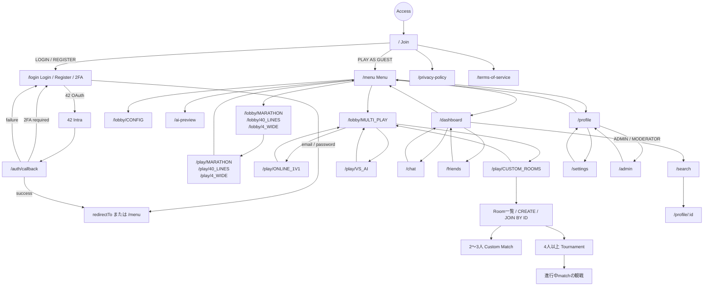

# Site Map

このドキュメントは、フロントエンドの画面遷移図です。

```mermaid
flowchart TD
    Access((Access)) --> Join["/  Join"]

    Join -->|PLAY AS GUEST| Menu["/menu  Menu"]
    Join -->|LOGIN / REGISTER| Login["/login  Login / Register / 2FA"]
    Join --> Privacy["/privacy-policy"]
    Join --> Terms["/terms-of-service"]

    Login -->|email / password| Requested["redirectTo または /menu"]
    Login -->|42 OAuth| Intra["42 Intra"]
    Intra --> Callback["/auth/callback"]
    Callback -->|success| Requested
    Callback -->|2FA required| Login
    Callback -->|failure| Login

    Menu --> LocalLobby["/lobby/MARATHON<br/>/lobby/40_LINES<br/>/lobby/4_WIDE"]
    Menu --> MultiLobby["/lobby/MULTI_PLAY"]
    Menu --> Config["/lobby/CONFIG"]
    Menu --> Preview["/ai-preview"]
    Menu --> Dashboard["/dashboard"]
    Menu --> Profile["/profile"]

    LocalLobby --> LocalPlay["/play/MARATHON<br/>/play/40_LINES<br/>/play/4_WIDE"]
    MultiLobby --> Random["/play/ONLINE_1V1"]
    MultiLobby --> Custom["/play/CUSTOM_ROOMS"]
    MultiLobby --> AI["/play/VS_AI"]

    Custom --> Room["Room一覧 / CREATE / JOIN BY ID"]
    Room --> Match["2〜3人 Custom Match"]
    Room --> Tournament["4人以上 Tournament"]
    Tournament --> Spectator["進行中matchの観戦"]

    Dashboard --> Chat["/chat"]
    Dashboard --> Friends["/friends"]
    Dashboard --> Search["/search"]
    Search --> PublicProfile["/profile/:id"]

    Profile --> Settings["/settings"]
    Profile -->|ADMIN / MODERATOR| Admin["/admin"]

    LocalPlay --> Menu
    Random --> MultiLobby
    Custom --> MultiLobby
    AI --> MultiLobby
    Dashboard --> Menu
    Profile --> Menu
    Chat --> Dashboard
    Friends --> Dashboard
    Settings --> Profile
    Admin --> Profile
```
