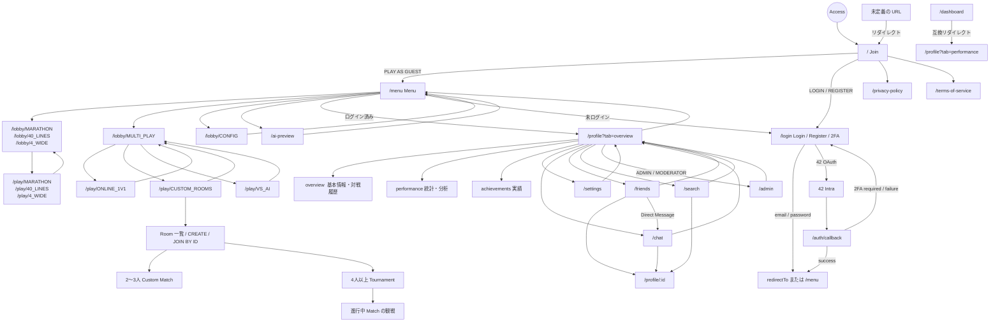

# Site Map

このドキュメントは、フロントエンドの画面遷移図です。

## URL 一覧

| URL | 画面・用途 | アクセス条件・補足 |
| --- | --- | --- |
| `/` | Join | ゲスト開始、ログイン、登録への入口 |
| `/login` | Login / Register / 2FA | 認証完了後は `redirectTo`、未指定時は `/menu` へ移動 |
| `/auth/callback` | 42 OAuth callback | OAuth の結果に応じて遷移 |
| `/menu` | Game Menu | ゲームモード、設定、AI Preview、プロフィールへの入口 |
| `/lobby/:mode` | Mode Lobby / Config | 対応する `mode` は下表を参照 |
| `/play/:mode` | Game | 対応する `mode` は下表を参照 |
| `/ai-preview` | AI Preview | AI の動作確認画面 |
| `/profile` | Profile | ログイン必須。`tab` で表示内容を切り替える |
| `/profile/:id` | Public Profile | ログイン必須。指定ユーザーの公開プロフィール |
| `/settings` | Account Settings | ログインユーザーのアカウント設定 |
| `/chat` | Chat | グローバルチャットと DM。`room` で DM ルームを指定可能 |
| `/friends` | Friends | フレンド、申請、ブロックの管理 |
| `/search` | User Search | ユーザー検索から `/profile/:id` へ移動 |
| `/admin` | Admin Panel | `ADMIN` または `MODERATOR` 向け |
| `/dashboard` | Legacy route | `/profile?tab=performance` へ置換リダイレクト |
| `/privacy-policy` | Privacy Policy | 公開ページ |
| `/terms-of-service` | Terms of Service | 公開ページ |
| その他 | Not Found | `/` へ置換リダイレクト |

## Mode 一覧

| URL | Mode | 内容 |
| --- | --- | --- |
| `/lobby/MARATHON` | `MARATHON` | Marathon の開始設定 |
| `/lobby/40_LINES` | `40_LINES` | 40 Lines の開始設定 |
| `/lobby/4_WIDE` | `4_WIDE` | 4-Wide の開始設定 |
| `/lobby/MULTI_PLAY` | `MULTI_PLAY` | Online 1v1、Custom Rooms、VS AI の選択 |
| `/lobby/CONFIG` | `CONFIG` | キー設定 |
| `/play/MARATHON` | `MARATHON` | Marathon |
| `/play/40_LINES` | `40_LINES` | 40 Lines |
| `/play/4_WIDE` | `4_WIDE` | 4-Wide |
| `/play/ONLINE_1V1` | `ONLINE_1V1` | ランダムマッチ |
| `/play/CUSTOM_ROOMS` | `CUSTOM_ROOMS` | カスタムルーム、トーナメント、観戦 |
| `/play/VS_AI` | `VS_AI` | AI 対戦 |
