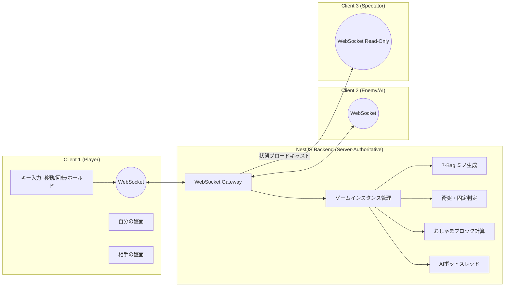

# ft_transcendence 対戦型テトリス（TETR.IO風）開発・完成ロードマップ

このドキュメントは、チーム4人で **TETR.IO 風の対戦型テトリスWebゲーム** を TypeScript フルスタック（Vite + React + NestJS）で構築するための具体的な開発計画です。

---

## 1. テトリス対戦ゲームのモジュールポイント設計

| カテゴリ | モジュール（ポイント） | テトリスでの具体的な実装内容 |
| :--- | :--- | :--- |
| **Web** | 1. フロント＆バックフレームワーク (2pts) | React + Vite（フロント） + NestJS（バック）の構成 |
| | 2. WebSocketsリアルタイム機能 (2pts) | 1v1対戦の操作同期、お互いの盤面のリアルタイム描画、チャット |
| | 3. ユーザー間対話機能 (2pts) | 基本的なチャットシステム、プロフィール閲覧、フレンドシステム（追加/削除/一覧表示） |
| | 4. データベースにORMを使用 (1pt) | Prisma ORM による PostgreSQL の操作 |
| | 5. カスタムデザインシステム (1pt) | サイバーパンク/ネオン調のテトリスUIコンポーネント（10個以上） |
| | **15. 公開API (Public API) (2pts)** | 保護されたAPIキー、レート制限、ドキュメント(Swagger)を備えた5つのエンドポイント |
| | **16. 高度な検索機能 (1pt)** | ユーザー・対戦履歴の検索（状態フィルター、勝率ソート、ページネーション） |
| **ユーザー管理** | 6. 標準ユーザー管理 (2pts) | プロフィール、アバター設定、フレンドのオンライン状態表示 |
| | 7. ゲーム統計と対戦履歴 (1pt) | 勝敗数に加え、**APM（ライン攻撃数/分）**, **PPS（ミノ落下速度/秒）**の表示 |
| | 8. OAuth 2.0 リモート認証 (1pt) | 42 API や GitHub 連携によるクイックログイン |
| | 9. 二要素認証 (2FA) (1pt) | ログイン時のセキュアなTOTP（Google Authenticator等）連携 |
| | **17. 高度な権限システム (2pts)** | 管理者・モデレーター・ユーザーの役割管理、管理者によるユーザーCRUD・BAN機能 |
| | **18. 組織システム (2pts)** | テトリスの「クラン（ギルド）」機能（クラン作成、メンバー招待・権限管理） |
| **データと分析** | **19. 高度な分析ダッシュボード (2pts)** | APMや勝率の推移グラフ、リアルタイム更新、PDF/CSVエクスポート機能 |
| | **20. データのインポート/エクスポート (1pt)** | ユーザー設定やキーバインド、戦績のJSON/CSV一括入出力サポート |
| | **21. GDPRコンプライアンス機能 (1pt)** | データ開示請求、確認メール付きアカウント完全削除、データ操作時のメール通知 |
| **ゲーム & UX** | 10. Webベース of ゲーム (2pts) | 基本的なテトリスゲーム（7-bagシステム、T-Spin判定、ライン消去） |
| | 11. リモートプレイヤー対戦 (2pts) | 1v1対戦、**おじゃまブロック（Garbage Line）の送り合い**、再接続機能 |
| | 12. トーナメントシステム (1pt) | 4人〜8人によるシングルトーナメント、進行状況ブラケット表示 |
| | 13. ゲームのカスタマイズ (1pt) | ミノのスキン（ネオン/レトロ）、落下速度、ゴースト表示のON/OFF |
| | **22. ライブ観戦機能 (1pt)** | 他プレイヤーの進行中の試合（盤面、スコア、おじゃまメーター）をリアルタイム観戦 |
| **AI** | 14. AI対戦相手 (2pts) | 盤面の高さや穴の数を評価して自律プレイするテトリスAIボット |
| **セキュリティ** | **23. WAF/Vault管理 (2pts)** | Nginx+ModSecurityによる厳格なWAF保護と、HashiCorp VaultによるAPIキー・環境変数の暗号化分離 |
| **合計** | **23モジュール / 35ポイント** | **（19ポイント以上でボーナス満点）** |

---

## 2. バックエンド（NestJS）開発の詳細設計（テトリス特化）

TETR.IO風の対戦型テトリスにおいて、バックエンドが担う役割は非常に重要です。

### 2.1 サーバー主導（Server-Authoritative）のゲームロジック
チート対策および公平な対戦環境のために、バックエンド側でゲームの状態を厳密に管理します。
1. **公平なミノ生成 (7-Bag Generator)**:
   * テトリスの標準規格である「7種類のミノを1セット（袋）としてランダムにシャッフルして配る」仕組みをバックエンドで実行し、両プレイヤーに同一の順序でミノを配信します。
2. **キー入力の同期と衝突判定 (Input Synchronization & Collision)**:
   * プレイヤーの「左移動」「右回転」「ハードドロップ」といった入力イベントを WebSocket でバックエンドに送信し、バックエンド側でグリッド衝突判定とブロック固定（Lock-down）を行います。
3. **攻撃ライン（Garbage Line）の送受ロジック**:
   * ダブル（2ライン消し）、トリプル（3ライン）、テトリス（4ライン）、T-Spinなどを達成した際、「相手に何ライン送るか」をバックエンドが判定。
   * 送られた攻撃は「おじゃまカウンター」として蓄積され、相手がミノを固定した瞬間にフィールド下部から「穴あきのグレーブロック」としてせり上がるロジックをバックエンドで計算・配信します。

### 2.2 テトリスAIボット（AI対戦相手）
* **評価関数アルゴリズム**:
  * AIは各ミノの置き場所候補（回転パターン×列数）をすべてシミュレートし、以下の評価値（ペナルティ）が最も低い場所を選択します。
    1. **高さ（Height）**: 盤面が積み上がるほど高いペナルティ。
    2. **穴の数（Holes）**: 下に隙間ができる配置（直上にブロックがある空マス）に非常に高いペナルティ。
    3. **平坦さ（Bumpiness）**: 隣り合う列の高さの差が大きいほどペナルティ。
  * **人間らしさの調整**: AIに「思考遅延（ミリ秒）」と「ミス確率（非最適な手を選択する確率）」のパラメータを持たせ、プレイヤーのレベルに合わせたAI難易度（Easy / Medium / Hard）を設定可能にします。

---

## 3. チーム役割に基づく4フェーズ並行開発ロードマップ

役割分担（Player 1〜4）を活かし、バックエンドとフロントエンドを直列ではなく**完全に並行して**開発します。

### 🛠️ フェーズ1: 基盤構築と設計（目安: 1週間）
* **[P1・P2担当]** Monorepo（Turborepo）の初期化。React(Vite)とNestJSのプロジェクト作成。
* **[P4担当]** Nginx (WAF), PostgreSQL, Redis, HashiCorp Vault の Docker Compose 初期構築および Prisma Schema 設計。
* **[全員]** `packages/shared/` にゲーム状態やインターフェースの共通型定義 (Shared Types) を作成。

### 💻 フェーズ2: コア機能の並行開発（目安: 3週間）
* **[P1 & P2担当]** PixiJSによるテトリス描画エンジン、ローカルキー操作処理、AI評価関数、観戦モードの実装を2人で分担。
* **[P3担当]** Reactによるネオン調SPA構築、UIコンポーネント（トーナメント表等）、ダッシュボード画面作成。
* **[P4担当]** NestJS API、対戦判定ループ、JWT/OAuth/2FA認証、Public API実装、およびセキュリティ(WAF)確保。

### 🔗 フェーズ3: システム統合・WebSocket結合（目安: 2週間）
* **[P1/P2 & P4]** フロントエンド（PixiJS）とバックエンド（NestJS）をWebSocketで接続し、1v1対戦と観戦機能の結合テスト。
* **[P3 & P4]** ダッシュボード画面（React）とDB（NestJS API）を繋ぎ込み、APM/PPSグラフや履歴のインポート/エクスポートを結合。
* **[P4]** 統合された環境に対し、Vaultの暗号化キー取得とWAFを通した通信テストを実施。

### 🏆 フェーズ4: 負荷テスト・品質ポリッシュ・評価対策（目安: 2週間）
* **[P3]** 全ブラウザでのコンソールエラー完全排除、GDPR準拠対応（アカウント削除機能）、法的ページの設置。
* **[P4]** 複数ユーザーの同時プレイを想定したRedis/WebSocketの負荷テスト・チューニング。
* **[全員]** 英語 `README.md` の作成（担当箇所明記）と、模擬評価（機能変更に数分で対応するライブコーディング練習）。

---

## 4. チーム4人の役割分担（推奨）

このプロジェクトを効率的かつ並行して進めるため、以下のような専門特化型の役割分担をします。

1. **Player 1 & 2: Game Engine & Frontend Logic (テトリス職人チーム)**
   * **担当:** PixiJSによるゲーム画面の描画、キー入力のローカル処理、WebSocketでのゲーム状態同期、AIや観戦機能。
   * **ミッション:** 一番重い「テトリス対戦コア機能と軽量なUI」を2馬力で最速で完成させる。
2. **Player 3: UI/UX & React Developer (デザイン・ダッシュボード職人)**
   * **担当:** React/ViteでのSPA構築、ネオン調デザインシステム、トーナメント表表示、ダッシュボードグラフ、モバイルUI。
   * **ミッション:** P1/P2が作った盤面を組み込み、「TETR.IO風のリッチで美しいWebアプリ」に仕上げる。
3. **Player 4: Backend, Database, DevOps & Security (サーバー・インフラ全般職人)**
   * **担当:** Docker構築、Nginx+WAF、Vault、NestJS API、Prisma(DB)、Redis、認証機能、ゲーム判定。
   * **ミッション:** 強固なセキュリティとインフラ土台を作り、すべてのAPIとデータ管理を一手に担う。
