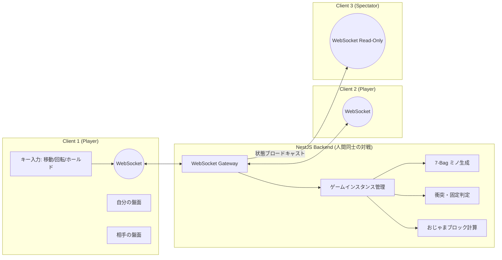

# ft_transcendence 対戦型テトリス（TETR.IO風）開発・完成ロードマップ

このドキュメントは、チーム4人で **TETR.IO 風の対戦型テトリスWebゲーム** を開発するための計画と現状整理です。Web側はTypeScript（Vite + React + NestJS）、AI探索はC++です。

2026-09-26時点の実装を反映しています。以下のモジュール表は候補一覧であり、完成・得点獲得の宣言ではありません。検証状況は [REMAINING_TASKS.md](REMAINING_TASKS.md)、採点条件は [subject.md](subject.md) を参照してください。第4・5節の担当と日程は当初の推奨案であり、実際の担当実績を示しません。

---

## 1. テトリス対戦ゲームのモジュールポイント設計

| カテゴリ | モジュール（ポイント） | テトリスでの具体的な実装内容 |
| :--- | :--- | :--- |
| **Web** | 1. フロント＆バックフレームワーク (2pts) | React + Vite（フロント） + NestJS（バック）の構成 |
| | 2. WebSocketsリアルタイム機能 (2pts) | 1v1対戦の操作同期、お互いの盤面のリアルタイム描画、チャット |
| | 3. ユーザー間対話機能 (2pts) | 基本的なチャットシステム、プロフィール閲覧、フレンドシステム（追加/削除/一覧表示） |
| | 4. データベースにORMを使用 (1pt) | Prisma ORM による PostgreSQL の操作 |
| | 5. カスタムデザインシステム (1pt) | サイバーパンク/ネオン調のテトリスUIコンポーネント（10個以上） |
| | **15. 公開API (Public API) (2pts)** | 保護されたAPIキー、レート制限、ドキュメント(Swagger)を備えた5つのエンドポイント |
| | **16. 高度な検索機能 (1pt)** | ユーザー・対戦履歴の検索（状態フィルター、勝率ソート、ページネーション） |
| **ユーザー管理** | 6. 標準ユーザー管理 (2pts) | プロフィール、アバター設定、フレンドのオンライン状態表示 |
| | 7. ゲーム統計と対戦履歴 (1pt) | 勝敗数に加え、**APM（ライン攻撃数/分）**, **PPS（ミノ落下速度/秒）** の表示 |
| | 8. OAuth 2.0 リモート認証 (1pt) | 42 OAuth連携。callbackはHTTPS（8443）へ統一済み。旧HTTP callbackでの実認可は確認済みで、新HTTPS callbackは42側への登録後に再確認予定 |
| | 9. 二要素認証 (2FA) (1pt) | ログイン時のセキュアなTOTP（Google Authenticator等）連携 |
| | **17. 高度な権限システム (2pts)** | 管理者・モデレーター・ユーザーの役割管理、管理者によるユーザーCRUD・BAN機能 |
| **データと分析** | **19. 高度な分析ダッシュボード (2pts)** | UTC日次集計APIによるAPM/PPS推移、全期間の勝率、WebSocket通知＋表示中15秒周期の更新、PDF/CSV出力 |
| | **20. データのインポート/エクスポート (1pt)** | JSON/CSV出力と、private game archiveの検証・プレビュー付き一括import |
| | **21. GDPRコンプライアンス機能 (1pt)** | データ開示請求、確認メール付きアカウント完全削除、データ操作時のメール通知 |
| **ゲーム & UX** | 10. Webベース of ゲーム (2pts) | 基本的なテトリスゲーム（7-bagシステム、T-Spin判定、ライン消去） |
| | 11. リモートプレイヤー対戦 (2pts) | 1v1対戦、**おじゃまブロック（Garbage Line）の送り合い**、再接続機能 |
| | **18. 3人以上のマルチプレイヤー (2pts)** | Custom Roomでの3〜4人対戦、複数盤面の配信、room単位の状態分離 |
| | 12. トーナメントシステム (1pt) | 4人〜8人によるシングルトーナメント、進行状況ブラケット表示 |
| | 13. ゲームのカスタマイズ (1pt) | ミノのスキン（ネオン/レトロ）、落下速度、ゴースト表示のON/OFF |
| | **22. ライブ観戦機能 (1pt)** | 他プレイヤーの進行中の試合（盤面、スコア、おじゃまメーター）をリアルタイム観戦 |
| **AI** | 14. AI対戦相手 (2pts) | 盤面の高さや穴の数を評価して自律プレイするテトリスAIボット |
| **セキュリティ** | **23. WAF/Vault管理 (2pts)** | 永続Vault server、最小権限token、自動/手動unseal運用、OWASP CRSによるWAF拒否試験 |
| **候補合計** | **23モジュール / 最大35ポイント** | 未実装の組織システムを除外。未完成・未検証の項目を含むため獲得済み点数ではない |

`subject.md` は完成したモジュールの実演を求め、未完成のモジュールは0点としています。必要点は14点です。最大35点の候補を「獲得済み」とは申告しません。確定申告点は残タスクの要件別検証後に算出します。表の番号は旧計画との対応を保っています。

---

## 2. 技術スタック

本プロジェクトで採用する主要な技術スタックを以下に整理します。

### 🎨 フロントエンド
* **言語/フレームワーク**: TypeScript, React, Vite
* **ゲーム描画エンジン**: PixiJS (Canvas/WebGLを活用した軽量かつ高速な描画)
* **リアルタイム通信**: WebSocket クライアント

### ⚙️ バックエンド
* **言語/フレームワーク**: TypeScript, NestJS
* **リアルタイム通信**: WebSocket
* **データベース・ORM**: PostgreSQL, Prisma
* **Redis**: refresh tokenの失効リスト、アカウント削除確認コードのハッシュ（TTL付き）、Public APIのレート制限カウンター。Socket.IOのRedis adapterや対戦状態の共有には使っていません。ルーム・接続復帰情報はbackendプロセスのメモリ内です。
* **AI探索**: C++実行ファイル `ai_agent` を試合・AIプレイヤーごとに起動し、標準入出力のJSONで連携

### 🔒 インフラ・セキュリティ・その他
* **コンテナ化・環境構築**: Docker, Docker Compose
* **リバースプロキシ・WAF**: Nginx + ModSecurity (Webアプリケーションファイアウォール)
* **シークレット管理**: HashiCorp Vault server mode、永続file storage、policy token、unseal運用。検証手順は残タスク第20・27項を参照
* **モノレポ管理**: Turborepo

---

## 3. バックエンド（NestJS）開発の詳細設計（テトリス特化）

TETR.IO風の対戦型テトリスにおいて、バックエンドが担う役割は非常に重要です。

### 3.1 サーバー主導の範囲とゲームロジック
上図と次の説明は `GameInstance` を使う人間同士の対戦（Random、Custom、その対戦インスタンス上のTournament）に適用します。全モードがサーバー主導という意味ではありません。

| モード | 盤面の進行・ミノ生成 | C++の役割 |
| :--- | :--- | :--- |
| ソロ | frontendのTSエンジン | なし |
| 人間同士 | backendのTSエンジン。ブラウザは入力を送信し、状態を描画 | なし |
| 人間 vs AI（人間側） | frontendのTSエンジン。`board_update`、`send_garbage`等をbackendへ送信 | なし |
| 人間 vs AI（AI側） | backendのTSエンジンが操作列を実行 | 盤面・next等から探索し、操作列を返す |
| Web AI Preview（ソロ/AI同士） | backendのTSエンジン | 探索のみ |

人間 vs AIの人間側はクライアントからの盤面・攻撃報告に依存しています。この経路を厳密なサーバー権威型や改ざん防止済みとは扱いません。モード間でミノ生成器が同一という保証もしていません。
1. **公平なミノ生成 (7-Bag Generator)**:
   * テトリスの標準規格である「7種類のミノを1セット（袋）としてランダムにシャッフルして配る」仕組みをバックエンドで実行し、両プレイヤーに同一の順序でミノを配信します。
2. **キー入力の同期と衝突判定 (Input Synchronization & Collision)**:
   * プレイヤーの「左移動」「右回転」「ハードドロップ」といった入力イベントを WebSocket でバックエンドに送信し、バックエンド側でグリッド衝突判定とブロック固定（Lock-down）を行います。
3. **攻撃ライン（Garbage Line）の送受ロジック**:
   * ダブル（2ライン消し）、トリプル（3ライン）、テトリス（4ライン）、T-Spinなどを達成した際、「相手に何ライン送るか」をバックエンドが判定。
   * 送られた攻撃は「おじゃまカウンター」として蓄積され、相手がミノを固定した瞬間にフィールド下部から「穴あきのグレーブロック」としてせり上がるロジックをバックエンドで計算・配信します。

### 3.2 テトリスAIボット（AI対戦相手）
* 難易度は **Easy / Hard / Expert** の3種類です。`AI_BOT_CONFIGS` はそれぞれC++の `easy` / `hard` / `expert` モデルへ対応します。
* Easyは1手の貪欲法、Hardは平積み・穴の抑制を重視したビームサーチ、ExpertはT-spin/B2B・開幕/中盤テンプレート等を含む探索です。全探索や最適解の保証ではありません。
* `AiAgentService` が試合・プレイヤー専用の子プロセスを起動し、通常対戦では `--think-ms 50` を指定します。C++は探索用に盤面をシミュレートしますが、実際のAI盤面はTS側で操作列を再生して確定します。AIボット専用のJavaScriptスレッドではありません。
* 操作の再生速度はUIから指定できます。探索予算と描画・操作の間隔は別です。共有設定に `mistakeRate` が存在することだけを根拠に、C++が一定確率で故意にミスすると説明してはいけません。
* 実装根拠: `apps/backend/src/game/engine/ai-agent.service.ts`、`apps/backend/src/game/game-instance.ts`、`apps/ai-agent/src/`、`packages/shared/src/index.ts`。

---

## 4. チーム役割に基づく4フェーズ並行開発ロードマップ

役割分担（Player 1〜4）を活かし、バックエンドとフロントエンドを直列ではなく**完全に並行して**開発します。

### 🛠️ フェーズ1: 基盤構築と設計（目安: 1週間）
* **[P1・P2担当]** Monorepo（Turborepo）の初期化。React(Vite)とNestJSのプロジェクト作成。
* **[P4担当]** Nginx (WAF), PostgreSQL, Redis, HashiCorp Vault の Docker Compose 初期構築および Prisma Schema 設計。
* **[全員]** `packages/shared/` にゲーム状態やインターフェースの共通型定義 (Shared Types) を作成。

### 💻 フェーズ2: コア機能の並行開発（目安: 3週間）
* **[P1 & P2担当]** PixiJSによるテトリス描画エンジン、ローカルキー操作処理、AI評価関数、観戦モードの実装を2人で分担。
* **[P3担当]** Reactによるネオン調SPA構築、UIコンポーネント（トーナメント表等）、ダッシュボード画面作成。
* **[P4担当]** NestJS API、対戦判定ループ、JWT/OAuth/2FA認証、Public API実装、およびセキュリティ(WAF)確保。

### 🔗 フェーズ3: システム統合・WebSocket結合（目安: 2週間）
* **[P1/P2 & P4]** フロントエンド（PixiJS）とバックエンド（NestJS）をWebSocketで接続し、1v1対戦と観戦機能の結合テスト。
* **[P3 & P4]** ダッシュボード画面（React）とDB（NestJS API）を繋ぎ込み、APM/PPSグラフや履歴のインポート/エクスポートを結合。
* **[P4]** 統合された環境に対し、Vaultの暗号化キー取得とWAFを通した通信テストを実施。

### 🏆 フェーズ4: 負荷テスト・品質ポリッシュ・評価対策（目安: 2週間）
* **[P3]** 全ブラウザでのコンソールエラー完全排除、GDPR準拠対応（アカウント削除機能）、法的ページの設置。
* **[P4]** 複数ユーザーの同時プレイを想定したRedis/WebSocketの負荷テスト・チューニング。
* **[全員]** 英語 `README.md` の作成（担当箇所明記）と、模擬評価（機能変更に数分で対応するライブコーディング練習）。

---

## 5. チーム4人の役割分担（推奨）

このプロジェクトを効率的かつ並行して進めるため、以下のような専門特化型の役割分担をします。

1. **Player 1 & 2: Game Engine & Frontend Logic (テトリス職人チーム)**
   * **担当:** PixiJSによるゲーム画面の描画、キー入力のローカル処理、WebSocketでのゲーム状態同期、AIや観戦機能。
   * **ミッション:** 一番重い「テトリス対戦コア機能と軽量なUI」を2馬力で最速で完成させる。
2. **Player 3: UI/UX & React Developer (デザイン・ダッシュボード職人)**
   * **担当:** React/ViteでのSPA構築、ネオン調デザインシステム、トーナメント表表示、ダッシュボードグラフ、モバイルUI。
   * **ミッション:** P1/P2が作った盤面を組み込み、「TETR.IO風のリッチで美しいWebアプリ」に仕上げる。
3. **Player 4: Backend, Database, DevOps & Security (サーバー・インフラ全般職人)**
   * **担当:** Docker構築、Nginx+WAF、Vault、NestJS API、Prisma(DB)、Redis、認証機能、ゲーム判定。
   * **ミッション:** 強固なセキュリティとインフラ土台を作り、すべてのAPIとデータ管理を一手に担う。
