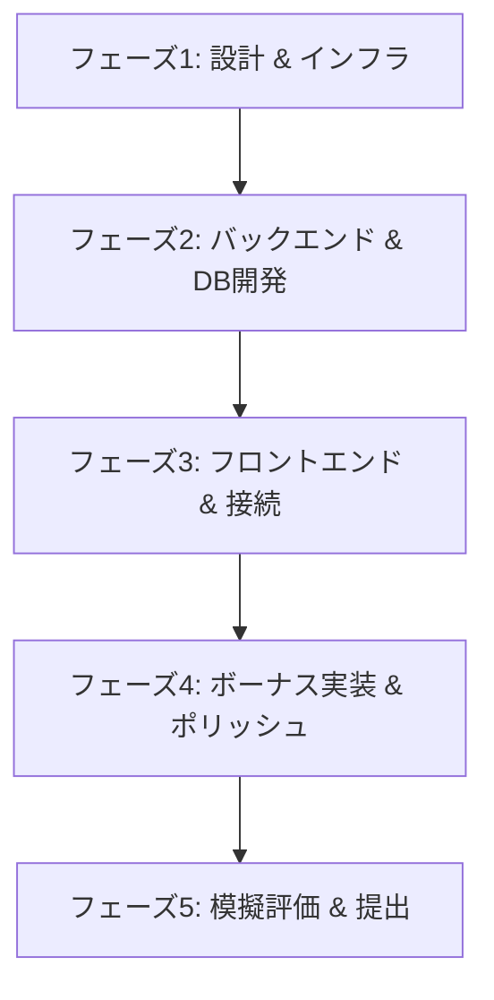

# ft_transcendence 完成ロードマップ

このドキュメントは、チーム4人で **ft_transcendence** の全開発工程と具体的な進め方をまとめたものです。

---

## 1. 開発の基本方針とチーム内の連携方法

評価時には「チームがどのように協調して開発したか」が厳しく問われます。

* **進捗管理**: GitHub Projects を使用。
* **定期同期ミーティング**: 週に1回（例: 土曜）、対面で以下の3点をクイックに同期します。
  1. 前回までに完了したこと
  2. 次回までにやること
  3. 発生しているブロッカー（課題・技術的な詰まり）
* **コードレビューと知識共有**: すべてのプルリクエストは、担当外のメンバーが最低2名レビューしマージします。特にバックエンドのゲーム同期ロジックや認証部分は、ライブコーディング対策として全員がコードの仕組みを説明できるようにします。

---

## 2. 完成までの全5フェーズ・詳細タスク

### 🛠️ フェーズ1: 設計と開発環境の立ち上げ（目安: 2週間） yukusano
全開発の土台となるシステム設計とコンテナ環境を構築します。

* **[設計] データベース論理・物理設計 (Tech Lead: C)**
  * テーブル設計: `Users` (パスワードハッシュ・ソルト保持), `Friends` (ステータス: 申請中/フレンド/ブロック), `MatchHistory` (スコア, 勝敗, タイムスタンプ), `Tournament` (ブラケット構造)。
* **[設計] API & WebSocketプロトコル定義 (全員)**
  * REST API エンドポイント設計（認証、ユーザー情報、履歴取得）。
  * WebSocket イベントスキーマ定義（ゲームのキー入力、座標更新、チャットメッセージ）。
* **[インフラ] Docker Compose 環境の構築 (Tech Lead: C)**
  * `docker-compose.yml` で `Nginx` (HTTPSリバースプロキシ), `Next.js` (Frontend), `Django/NestJS` (Backend), `PostgreSQL`, `Redis` の5コンテナを一発起動可能にする。
  * ローカル開発用の自己署名SSL証明書をマウントし、HTTPS/WSS接続を初期から確保。

---

### 💻 フェーズ2: バックエンド & データベース開発（目安: 3週間） sonakamu, ssawa
本プロジェクトの最重要パーツであるバックエンドロジックを先行して作り込みます。

* **[認証] セキュアなユーザー認証システムの構築 (C)**
  * メールアドレスとパスワードによるサインアップ/サインイン API。
  * パスワードのハッシュ化（Argon2 または bcrypt）とソルトの適用。
  * JWT (JSON Web Token) によるセッション管理とリフレッシュトークン。
  * **OAuth 2.0 連携**: 42 API または GitHub API を使用したソーシャルログイン機能。
  * **2FA (二要素認証)**: Google Authenticator 等と連携する TOTP (Time-Based One-Time Password) の生成・検証 API。
* **[ゲーム] サーバー主導型ゲームエンジンの開発 (D)**
  * レースコンディションやクライアント側のチートを防ぐため、**ボール・パドルの座標計算はすべてバックエンド（サーバー側）**でループ処理する。
  * Redis をメッセージブローカーとして使用し、WebSocket を介して 1/60 秒（60FPS）周期で両クライアントに最新の座標をブロードキャストする。
* **[AI] AI対戦相手のアルゴリズム (D)**
  * ボールのY座標を追尾する単純なアルゴリズムに加え、人間らしさを出すための「反応遅延」「予測の揺らぎ（エラー率）」を設定できるゲームAIクラスの実装。
* **[チャット] リアルタイム対話 & ステータス管理 (B)**
  * ユーザーのオンライン/オフライン状態を Redis 内で管理し、状態変更時にフレンド全員へ WebSocket で通知。
  * 個人チャット（DM）および部屋ごとのメッセージ保存・配信ロジック。
  * 特定ユーザーのブロック機能（ブロックされた相手からのメッセージは表示しない）。

---

### 🎨 フェーズ3: フロントエンド構築 & バックエンド接続（目安: 3週間） kaisuzuk, yukusano
UIの構築と、フェーズ2で作成したバックエンドAPI/WebSocketとの結合を行います。

* **[UI] デザインシステムと共通コンポーネントの構築 (PO: A)**
  * Tailwind CSS（またはその他のCSSフレームワーク）を使用し、10個以上の再利用可能な共通コンポーネント（Button, Input, Card, Modal, Dropdown, Table等）を作成。
  * レスポンシブ対応およびアクセシビリティ（スクリーンリーダー、キーボードナビゲーション）の基礎実装。
* **[接続] 認証・ユーザー管理画面の構築 (A, C)**
  * ログイン、ユーザー登録、プロフィール編集（アバター画像のアップロード機能含む）画面。
  * OAuth認証のリダイレクト処理および2FA用のQRコード読み取り/コード入力画面。
* **[接続] リアルタイムゲーム・チャット画面の接続 (B, D)**
  * HTML5 Canvas または Three.js を使用したゲーム描画エンジン。
  * ネットワークの遅延を抑えるための、簡易的な「クライアント側予測（Client-side Prediction）」および「状態補間（Interpolation）」。
  * チャット画面（入力中インジケーター、既読表示、チャットからのゲーム招待ボタン）。

---

### 🏆 フェーズ4: ボーナス機能の実装 & 品質ポリッシュ（目安: 2週間）
14ポイントの必須機能に加え、ボーナス5ポイントを完璧に奪取するための拡張機能と品質向上を行います。

* **[ボーナス] トーナメントシステムの実装 (B, D)**
  * 4人または8人のプレイヤーによるシングルトーナメント管理。
  * マッチ完了ごとに自動でブラケットが更新され、次の対戦者同士に通知が飛ぶロジック。
* **[ボーナス] ゲーム統計のデータ可視化ダッシュボード (A, D)**
  * ユーザーの対戦履歴（勝敗数、勝率、対戦日時）を PostgreSQL から取得。
  * チャートライブラリ（Chart.js 等）を用いて、プレイヤーのレーティング推移や勝率をビジュアル表示。
* **[ボーナス] ゲームのカスタマイズ (A, B)**
  * ゲーム開始時の設定画面で、パドルスピード、ボールサイズ、マップ背景（ダークテーマ/ネオンテーマ）を変更できる機能。
* **[品質] 法的ドキュメントの配置 (PO: A)**
  * フッターに「Privacy Policy」と「Terms of Service」のリンクを設置し、詳細なポリシー文面を静的ページとして作成。
* **[品質] クロスブラウザ検証 & コンソールエラー撲滅 (全員)**
  * Chrome, Firefox, Safari の各ブラウザで一通り動かし、CSSの崩れがないか確認。
  * ログインからゲーム、ログアウトに至る全手順で、Chrome の F12 開発者ツールのコンソールに一切のエラー/警告が出ないよう修正。

---

### 🎓 フェーズ5: 模擬評価 & 提出（目安: 1週間）
ピア評価で不合格にならないための最終防衛ラインを構築します。

* **[ドキュメント] 英語の README.md 完成 (PO: A)**
  * 規定の斜体（1行目）を必ず配置。
  * チームメンバの役割、技術スタック、DBスキーマ（Mermaid図等）、モジュールのポイント内訳（21pt分）を詳細に記述。
* **[評価対策] 模擬ライブコーディングテスト (全員)**
  * 評価者が「少しルールを変えて（例: ボールの初期速度を上げる、チャットの文字制限を変える等）」と要求してきた場合を想定し、設定値（環境変数や定数クラス）を即座に変更してデプロイし直す練習を全員で行います。

---
