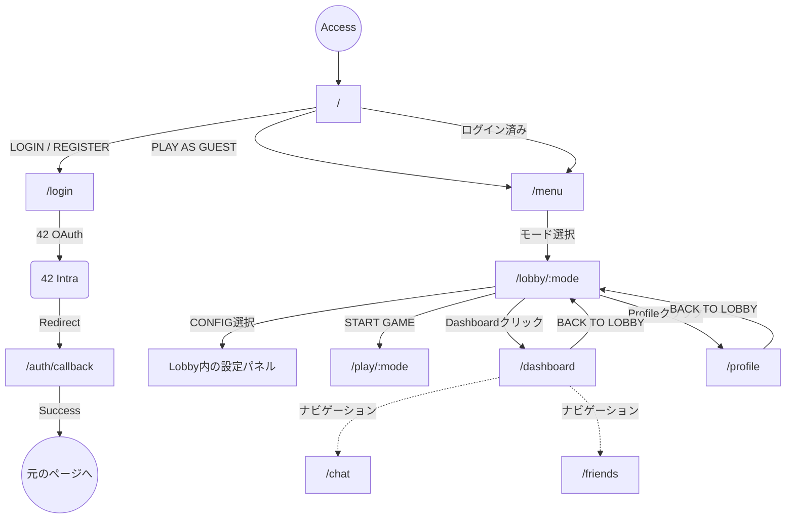

# Site Map

このドキュメントはフロントエンド全体の画面遷移およびルーティング構造をまとめたものです。

## 1. 画面遷移フロー

## 2. ルート一覧

| Path (URL) | 対応コンポーネント | アクセス権限 | 概要・機能 |
| :--- | :--- | :--- | :--- |
| `/` | `JoinPage` | Public | トップページ。「PLAY AS GUEST（ゲストプレイ）」または「LOGIN / REGISTER」を選択する入り口。 |
| `/login` | `Login` | Public | フォームログイン・新規登録、および 42 OAuth 認証を行う画面。 |
| `/auth/callback` | `OAuthCallback` | Public | 42 OAuth 認証完了後のコールバック処理（トークン保存＆リダイレクト）を担当。UIは持たない。 |
| `/menu` | `MenuPage` | Public (Guest含む) | テトリスのモード（MARATHON, 40 LINES, ONLINE 1v1 など）を選択するメインメニュー。背景でテトリスが自動再生される。 |
| `/lobby/:mode` | `LobbyPage` | Public (Guest含む) | 選択したモードの待機ロビー。開始レベルの調整、キーボード設定(CONFIG)、ローカル・グローバルランキングの確認が行える。 |
| `/play/:mode` | `PlayPage` | Public (Guest含む) | 実際のテトリスプレイ画面。PixiJSによるゲームエンジンが動作する。 |
| `/dashboard` | `Dashboard` | Authenticated | ログインユーザー専用のダッシュボード。自身のAPM、勝率、対戦履歴などの統計データを表示。ロビーからアクセスし、ロビーへ戻る。 |
| `/profile` | `Profile` | Authenticated | ユーザーのプロフィール表示・編集、アバター変更設定など。ロビーからアクセスし、ロビーへ戻る。 |
| `/chat` | `Chat` | Authenticated | 【AppShell配下】リアルタイムチャット画面。グローバルチャットやダイレクトメッセージ（予定）。 |
| `/friends` | `Friends` | Authenticated | 【AppShell配下】フレンドリスト画面。フレンドのオンライン状態や対戦申し込み（予定）。 |
| `/*` | `Navigate to /` | Public | 存在しないURLにアクセスした場合のフォールバック。自動的にトップページへリダイレクト。 |

## 3. 今後の拡張予定

`proceed.md` の要件に基づき、今後以下の画面や状態が追加される予定です。

- **トーナメント画面 (Tournament Bracket)**: 4〜8人用のシングルトーナメント進行状況を表示するUI。
- **ライブ観戦画面 (Spectator Mode)**: 他プレイヤーの対戦（1v1やトーナメント）をリアルタイムで観戦するビュー。
- **管理者ダッシュボード (Admin/Moderator Panel)**: ユーザーのCRUDやBAN権限を持つ高度な管理画面（Role管理）。
- **クラン・組織管理 (Clan/Guild)**: チームの作成、メンバー管理画面。
